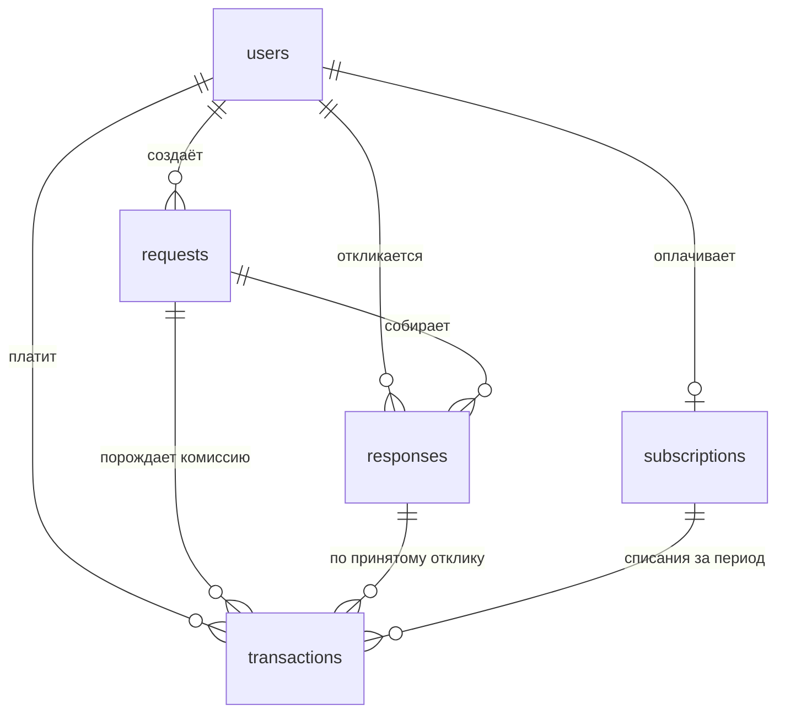

# OPUS GROUP

От фото дома до бригады на объекте — конструктор, который строит 3D-модель
дома по фотографиям, считает смету на материалы по ходу редактирования и
подбирает бригаду для монтажа.

See `DESIGN.md` for the design system (color tokens, type scale, layout
wireframe, and the signature landing element).

## Stack

- Next.js (App Router) + TypeScript + Tailwind CSS v4
- `@react-three/fiber` + `@react-three/drei` for the 3D editor canvas
- `zustand` for editor/cart state
- `motion` for the landing hero's photo-to-model reveal
- Self-hosted Unbounded + Manrope (`public/fonts`, `src/app/fonts.css`) — no
  Google Fonts CDN

## 3D provider

The 3D generation vendor (Neural4D) isn't wired up yet. Every screen is
built against the `Model3DProvider` interface in `src/lib/3d/provider.ts`
and runs against `MockModel3DProvider` (`src/lib/3d/mock-provider.ts`),
which returns a believable demo house after a realistic delay. Swapping in
the real vendor later means adding one class and changing the factory in
`src/lib/3d/index.ts` — nothing else in the app touches the vendor
directly. Vendor requests must proxy through a backend route; never call
Neural4D from the browser.

## Getting started

```bash
npm install
npm run dev
```

Open [http://localhost:3000](http://localhost:3000). The editor
(`/editor`) works fully offline against the mock provider — use "Посмотреть
на демо-доме" to skip straight to a generated model.

## Scripts

```bash
npm run dev     # start the dev server
npm run build   # production build
npm run lint    # eslint
npm run db:check # проверить подключение к PostgreSQL
npm run db:migrate        # применить новые миграции
npm run db:migrate:status # посмотреть, что применено, а что нет
npm run db:cleanup        # почистить журнал попыток входа (раз в сутки)
npm run billing:charge    # списать подписки, у которых истёк период (раз в сутки)
```

## Где вписать ключ Neural4D

**Локально:** в файле `.env` в корне проекта, строка `NEURAL4D_API_KEY=` —
впишите значение сразу после `=`, без кавычек и пробелов. Файл в git не
попадает. После правки перезапустите dev-сервер: `.env` читается при старте.

**На Vercel:** Settings → Environment Variables → `NEURAL4D_API_KEY`.
Никакого префикса `NEXT_PUBLIC_` — с ним Next подставит значение в
браузерный бандл, и ключ увидит любой посетитель.

Пока ключ пуст, `/api/neural4d/generate` отвечает `{ configured: false }`, и
приложение работает на демо-модели — то есть пустой `.env` ничего не ломает.

### Как устроена защита

- `NEURAL4D_API_KEY` читает единственный модуль — `src/lib/server/neural4d-config.ts`.
  Он импортирует `server-only`, поэтому сборка **падает**, если его случайно
  импортировать из клиентского компонента.
- Браузер никогда не обращается к вендору. Фотографии уходят на наш маршрут
  `POST /api/neural4d/generate`, и ключ добавляется там, на сервере.
- Ключ не логируется. В лог пишется только статус ответа вендора; наружу
  уходит обобщённое сообщение, а не тело чужого ответа.
- Адрес вендора задаётся только через окружение и никогда клиентом — иначе
  маршрут стал бы открытым прокси (SSRF).

Проверено «канарейкой»: со подставленным тестовым значением сборка не
содержит его ни в одном файле `.next/static`, а ответы и логи чисты.

## База данных PostgreSQL

Проект подключается к Managed Service for PostgreSQL в Yandex Cloud. Все
настройки — только через переменные окружения, ни одного значения в коде.

**Как настроить локально:**

1. `cp .env.example .env`
2. Заполните в `.env` четыре обязательные строки: `DB_HOST` (FQDN хоста из
   консоли Yandex Cloud, вида `rc1b-xxxxxxxxxxxxxxxx.mdb.yandexcloud.net`),
   `DB_NAME`, `DB_USER`, `DB_PASSWORD`. `DB_PORT` уже стоит `6432` — это порт
   пулера соединений, подключаться нужно через него.

   Хост можно вставлять прямо из адресной строки: `https://` и слэш на конце
   срезаются сами. А вот публичный доступ к хосту должен быть включён
   (Кластер → Хосты → Изменить), иначе имя не существует в публичном DNS и
   подключиться снаружи облака нельзя в принципе.
3. Скачайте корневой сертификат облака и укажите путь к нему в
   `DB_SSL_ROOT_CERT`:

   ```bash
   mkdir -p ~/.postgresql
   curl -o ~/.postgresql/root.crt https://storage.yandexcloud.net/cloud-certs/CA.pem
   ```

4. `npm run db:check` — скрипт делает один тестовый запрос и печатает, к чему
   подключился, или объясняет, что именно не так.

**На Vercel:** те же имена в Settings → Environment Variables. Префикса
`NEXT_PUBLIC_` быть не должно — с ним Next подставит пароль в браузерный
бандл. Файла на диске там нет, поэтому `DB_SSL_ROOT_CERT` не задаётся:
соединение остаётся шифрованным, но без проверки сертификата.

### Как это устроено

- `src/lib/server/db-config.ts` — единственное место, которое читает пароль.
  Импортирует `server-only`, поэтому сборка **падает** при случайном импорте
  из клиентского компонента.
- `src/lib/server/db.ts` — пул соединений (`getPool`, `query`, `pingDatabase`).
  Пул создаётся лениво и переиспользуется между горячими перезагрузками, иначе
  за час разработки был бы выбран лимит соединений базы.
- Запросы всегда параметризованные (`$1`, `$2`), склейки строк с SQL нет —
  значение не может превратиться в код (SQL-инъекция).
- `.env` закрыт `.gitignore` (`.env*`, кроме `.env.example`), поэтому реальный
  пароль в GitHub не попадёт.

## Схема базы и миграции

Схема живёт в `migrations/` — обычные `.sql`-файлы с номерами. Применённые
записываются в таблицу `schema_migrations` в той же базе, поэтому список
применённого не может разойтись с данными при копировании базы.

```bash
npm run db:migrate:status   # что применено, а что ещё нет
npm run db:migrate          # применить всё, что осталось
```

**Правило одно: применённый файл не редактируют.** База помнит его
контрольную сумму и откажется работать, если файл изменился, — иначе правка
молча не доехала бы до сервера, где эта версия уже отмечена выполненной.
Любое изменение схемы — новый файл со следующим номером.

Каждый файл применяется в транзакции: либо целиком, либо база остаётся
нетронутой. Схема, застрявшая на середине файла, чинится руками на живом
сервере — этого допускать нельзя.

### Таблицы



| Таблица | Что хранит | Ключевые правила |
|---|---|---|
| `users` | все люди: `client`, `executor`, `moderator`, `admin` | нужен хотя бы один контакт — почта или телефон; почта уникальна без учёта регистра |
| `requests` | заявки клиентов: что, где, по какой модели дома | модель из редактора лежит целиком в `scene_model jsonb`; опубликованная заявка обязана иметь `published_at` |
| `responses` | отклики исполнителей: цена, срок, сообщение | один отклик от исполнителя на заявку; принятый отклик только один; на свою заявку откликнуться нельзя |
| `subscriptions` | подписка исполнителя (в интерфейсе — «Technic») | одна действующая подписка на человека; доступ проверяется по `current_period_end`, а не по `status` |
| `transactions` | оплата подписок, комиссия со сделок, выплаты, возвраты | `net_amount = gross_amount − commission_amount` проверяется базой; `commission_rate` — доля от суммы, а не проценты; размер ставки схемой не задан |

Деньги — `numeric(14, 2)`, никогда `float`: `double precision` хранит `0.1`
приблизительно, и на сотне комиссий сумма разъезжается с бухгалтерией.
Ставка комиссии хранится вместе с суммой, а не берётся из настроек при
чтении: ставка со временем меняется, и пересчёт старых сделок по новой
ставке испортил бы прошлые отчёты.

Удаление людей — `ON DELETE RESTRICT`: заявка без автора и платёж без
плательщика ломают отчётность. Ушедший пользователь получает
`status = 'deleted'`, строки остаются.

## Регистрация, вход и роли

```
POST /api/auth/register   почта + пароль + роль (только client или executor)
POST /api/auth/login      выдаёт сессию
POST /api/auth/refresh    продлевает её, перечитывая роль из базы
POST /api/auth/logout     отзывает сессию
GET  /api/auth/me         профиль текущего пользователя
```

Перед первым запуском задайте `AUTH_JWT_SECRET` в `.env`:

```bash
openssl rand -base64 48
```

Тот, кто знает этот секрет, может выписать себе токен с ролью `admin` — это
такой же секрет, как пароль от базы.

### Как устроен вход

**Пароли** хранятся как bcrypt-хеш со стоимостью 12
(`src/lib/server/auth/password.ts`), никогда в открытом виде. bcrypt выбран
потому, что он нарочно медленный: SHA-256 видеокарта считает миллиардами в
секунду и проходит словарь популярных паролей за доли секунды, а здесь один
хеш занимает ~0,3 с.

**Токенов два**, и это главное решение:

| | access | refresh |
|---|---|---|
| что это | JWT, подпись HS256 | 32 случайных байта |
| живёт | 15 минут | 30 дней |
| проверяется | подписью, без запроса к базе | по хешу в `auth_sessions` |
| можно отозвать | нет | да |

Подписанный JWT нельзя отозвать: после «выйти» или блокировки он работает до
конца своего срока. Поэтому он короткий, а продление идёт через
refresh-токен, который лежит в базе и помечается отозванным. Отзыв
срабатывает в пределах 15 минут — это цена за то, что обычная проверка не
ходит в базу на каждый запрос.

JWT **не зашифрован**: содержимое читает кто угодно, подпись защищает только
от подмены. Поэтому внутри лежат лишь id, роль и id сессии — ни почты, ни
телефона.

**Токены — в cookie с `httpOnly`**, не в `localStorage`: такой cookie
недоступен из JavaScript, поэтому чужой скрипт на странице (XSS) не может его
прочитать. Refresh-cookie ограничен путём `/api/auth`, чтобы длинный токен не
уходил с каждым запросом.

### Проверка роли

Каждый защищённый обработчик начинается одинаково:

```ts
export async function GET() {
  const auth = await requireRole(["moderator", "admin"]);
  if (!auth.ok) return auth.response;   // 401 или 403
  // здесь auth.user точно есть и точно нужной роли
}
```

Проверка стоит **в самом обработчике**, рядом с данными. `src/proxy.ts`
(в Next 16 так теперь называется бывший `middleware.ts`) только уводит гостя
со страницы на форму входа — он смотрит лишь на наличие cookie и защитой не
является. Защита снаружи выглядит работающей ровно до первого маршрута,
который забыли внести в `matcher`.

`401` — «не знаю, кто ты», клиент идёт за новым токеном и повторяет запрос.
`403` — «знаю, но нельзя», повторять бессмысленно.

### Ограничение частоты попыток входа

bcrypt делает перебор медленным, но не невозможным: ~0,3 с на хеш — это три
пароля в секунду с одной машины и триста с сотни. Словарь из миллиона
популярных паролей при таком темпе проходится меньше чем за час. Поэтому
пределов два, и они разные по назначению:

| предел | сколько | зачем |
|---|---|---|
| на адрес почты | 5 неудач за 15 минут | прицельный подбор одного аккаунта |
| на адрес источника (IP) | 20 неудач за 15 минут | «распыление»: по одному паролю к тысяче аккаунтов |

Пять — потому что живой человек ошибается два-три раза (не та раскладка,
Caps Lock, старый пароль), а перебору это оставляет 480 попыток в сутки
вместо десятков миллионов. Двадцать на IP — заметно свободнее, потому что
офис, кафе и мобильный оператор выпускают в интернет сотни людей через один
адрес, и строгий предел заблокировал бы всех из-за одного забывчивого.

Окно скользящее: оно не сбрасывается разом, а «стекает», поэтому после
ожидания открывается одна попытка, а не сразу пять. Удачный вход стирает
накопленные неудачи. Ответ на превышение — `429` с заголовком `Retry-After`.

Предел применяется одинаково к существующим и выдуманным адресам — иначе он
сам стал бы способом узнать, кто зарегистрирован («этот отвечает 429, а этот
401»). Счётчик живёт в PostgreSQL (`login_attempts`), а не в памяти процесса:
на Vercel запросы расходятся по нескольким копиям приложения, у каждой был бы
свой счётчик, и предел множился бы на их число.

**Обратная сторона:** пока адрес заблокирован, не входит и настоящий владелец
— значит, зная чужую почту, можно намеренно закрыть человеку вход на 15 минут.
Это осознанный размен: альтернатива (не ограничивать вовсе) хуже. Блокировка
временная и снимается сама.

Журнал попыток растёт с каждым входом — `npm run db:cleanup` удаляет записи
старше суток. Стоит поставить на ежедневный запуск (Cron Job на Vercel).

### Страницы

- `/login` — вход и регистрация, переключаются вкладками.
- `/cabinet` — профиль и выход. Закрыт: гостя уводит на `/login?next=/cabinet`.

### Автоматическое продление сессии

Запросы из браузера идут через `useApiFetch` (`src/lib/auth/`). Получив `401`,
он один раз зовёт `/api/auth/refresh` и повторяет исходный запрос — человек
ничего не замечает. Если продлить нечем (вышли, заблокировали, истекли 30
дней), уводит на `/login?next=…`.

Два места, где легко ошибиться:

- **Повтор ровно один.** Токен только что обновлён; если и повтор вернул
  `401`, дело не в сроке, и второй заход лишь устроит бесконечный цикл.
- **Одно продление на всех.** Страница шлёт несколько запросов разом, и все
  получают `401` одновременно. Без общего обещания каждый пошёл бы продлевать
  сам — а refresh-токен при продлении заменяется, поэтому второе продление
  пришло бы с уже отозванным токеном и выкинуло человека из аккаунта.

Глобальный `fetch` намеренно не подменяется: под такой перехват попали бы
запросы самого Next и сторонних библиотек. Навигация живёт в хуке, а не в
сетевом модуле, — `window.location` из недр сетевого слоя перезагружал бы
приложение целиком.

## Заявки

```
GET  /api/requests                      клиенту — свои, исполнителю — лента новых
POST /api/requests                      создать (только client)
GET  /api/requests/{id}                 заявка с откликами
POST /api/requests/{id}/responses       откликнуться (только executor)
POST /api/responses/{id}/accept         принять отклик (только владелец заявки)
POST /api/requests/{id}/status          завершить или отменить (только владелец)
```

Путь заявки:

```
Новая ──принят отклик──▶ В работе ──клиент подтвердил──▶ Завершена
  │                          │
  └────────Отменена ◀────────┘
```

Переходы заданы таблицей в `src/lib/server/requests/status.ts`, а не
россыпью `if` по обработчикам: правило «завершённую нельзя отменить»
читается с одной строки. В базе есть пятый статус `draft` — место под
черновики оставлено в схеме, но через API он пока не выдаётся.

### Что здесь важно

**Роль — не право на конкретную строку.** `requireRole(["client"])` отвечает
на вопрос «клиент ли ты вообще», но не «твоя ли это заявка». Без второй
проверки любой клиент завершил бы чужую заявку, зная её id. Владелец
сверяется прямо в запросе (`where client_id = $2`), а не отдельным чтением:
между чтением и записью состояние успевает измениться.

**Подтверждает выполнение клиент, а не исполнитель** — иначе исполнителю
хватило бы нажать «готово», чтобы работа считалась принятой.

**Принятие отклика — одна транзакция:** отклик становится принятым, остальные
отклонёнными, заявка уходит в работу. Оборвись связь посередине — заявка
осталась бы «новой» с уже принятым откликом. Строка заявки при этом
блокируется (`for update`), иначе два одновременных подтверждения оба
прочитали бы «новая» и оба прошли бы проверку.

**Исполнитель видит только свой отклик** на чужой заявке: чужие цены — чужая
коммерческая информация, по ней подстраивают собственную.

## Платежи: Т-Касса

Интернет-эквайринг Т-Банка. **Реквизиты карты к нам не попадают никогда** —
человек вводит их на странице банка, мы обмениваемся только суммами и
номерами платежей. Поэтому приложение не подпадает под требования к хранению
карточных данных (PCI DSS).

По умолчанию приём платежей **выключен** (`TKASSA_ENABLED=false`): забытый в
окружении ключ не должен начать списывать деньги сам.

```
POST /api/subscriptions/checkout        исполнитель начинает оплату → ссылка на банк
POST /api/payments/tkassa/webhook       уведомления банка (без входа, по подписи)
npm run billing:charge                  ежемесячные списания, ставить на cron
```

### Как устроено автосписание

1. Исполнитель нажимает «Оформить». Мы заводим строку платежа, её id уходит
   банку как `OrderId`, и человек уходит на страницу оплаты.
2. Платёж создаётся с `Recurrent: "Y"` — «запомнить карту». После успешной
   оплаты банк присылает `RebillId`; мы кладём его в `subscriptions`.
   Это не номер карты: по нему можно только списать через наш же терминал.
3. Дальше `billing:charge` раз в сутки берёт подписки с истёкшим периодом и
   списывает следующий месяц по `RebillId` — человека никуда не отправляют.

Раз в сутки, а не раз в месяц: «раз в месяц» — это один шанс в году что-то не
заметить, а ежедневный запуск сам догоняет пропущенное.

Если списание не прошло, подписка помечается `past_due`, но **доступ сразу не
отбирается**: карту могли перевыпустить, денег могло не хватить один день.
Через трое суток период истекает сам.

### Вебхук

Единственный маршрут без проверки входа — и так и должно быть: сюда стучится
банк, у которого нет нашей сессии. Вместо входа здесь **подпись**: SHA-256 от
значений параметров, отсортированных по имени ключа, с добавленным паролем
терминала. Без этой проверки вебхук был бы открытой дверью — кто угодно
прислал бы «платёж прошёл» и получил подписку даром.

Два свойства, без которых всё разваливается:

- **Повторное уведомление не продлевает подписку второй раз.** Банк повторяет
  уведомления при любой заминке в ответе; без защиты человек получил бы
  шестьдесят дней за одну оплату. Строка платежа блокируется (`for update`) и
  переходит в `succeeded` только из `pending`.
- **На свою ошибку отвечаем `500`, на чужую — `OK`.** `500` заставляет банк
  повторить, и это правильно, когда у нас упала база. Но на мусорный
  `OrderId` повтор ничего не исправит — там `OK`, иначе банк будет стучаться
  сутками.

## Комиссия

Считается при завершении заявки, **той же транзакцией**: завершённая заявка
без строки в учёте — это недостача, которую обнаружат при сверке в конце
квартала, когда восстанавливать сумму уже неоткуда.

```
комиссия = агентское вознаграждение (фикс.) + доля от суммы сделки
исполнителю = сумма сделки − комиссия
```

Обе части настраиваются окружением и **по умолчанию нулевые**:

| переменная | что это |
|---|---|
| `COMMISSION_AGENT_FEE` | фиксированная сумма за сделку, в рублях |
| `COMMISSION_RATE` | доля от суммы: `0.07` — это 7% |

Ноль по умолчанию выбран сознательно: значение «как обычно берут» означало бы,
что забытая настройка молча удерживает деньги у исполнителей.

Арифметика выполняется **в PostgreSQL**, а не в JavaScript: `165000 * 0.07` в
JS даёт `11550.000000000002`, и это число поехало бы в отчёт. Ставка и обе
части записываются в строку платежа — ставка со временем меняется, а
пересчитывать прошлые сделки по новой нельзя, это переписало бы сданную
отчётность.

Отклик без цены («по смете объекта») комиссии не порождает: её сумма нам
неизвестна.

### Чего пока нет

- Чеков по 54-ФЗ (`Receipt` в запросе к банку) — нужны при работе с
  физлицами, добавляются вместе с онлайн-кассой.

## Модерация

`/moderation` — для ролей `moderator` и `admin`.

**Решение без причины не сохраняется.** Причина не пожелание, а часть
решения: 289-ФЗ требует, чтобы ограничение доступа можно было объяснить тому,
кого ограничили. Требование стоит в трёх местах сразу — кнопка не активна,
пока причина не написана; сервер проверяет её сам; и в базе висит
`check (length(btrim(reason)) >= 10)`. Интерфейс убеждает, сервер обязывает,
база гарантирует.

Смена статуса и запись причины идут одной транзакцией — иначе появляется
заблокированный пользователь без объяснения, то есть ровно то, чего закон и
требует избегать. Причина последнего решения показана прямо в карточке:
модератор, снимающий блокировку, должен видеть, за что она была наложена.

Блокировка **закрывает все сессии** пользователя. Без этого он продолжал бы
работать до конца жизни своего токена, и «заблокирован» осталось бы словом.

## Профили исполнителей

Захардкоженный список бригад (`src/lib/crews.ts`) удалён — страница
«Бригады» показывает реальных исполнителей из базы: навыки, описание,
ориентир по цене, портфолио.

**Рейтинг не хранится, а считается** из завершённых заявок при каждом
запросе. Хранимое число пришлось бы пересчитывать при каждом изменении
заявки, и рано или поздно оно разошлось бы с реальностью — такие поля всегда
врут после первой же забытой ветки кода.

Звёзд больше нет, и это осознанно. Звезда требует отзывов, а отзывов мы пока
не собираем: «★ 4.9» без единого отзыва — картинка, вводящая заказчика в
заблуждение. Показывается то, что известно из базы: сколько заявок бригада
довела до «завершена» и какая доля принятых сделок сорвалась. У новичка
написано «пока без завершённых заявок», а не ноль звёзд, который читается как
«плохой».

## Подтверждение почты и восстановление пароля

```
POST /api/auth/verify-email      прислать письмо со ссылкой
PUT  /api/auth/verify-email      подтвердить по ссылке
POST /api/auth/password-reset    прислать ссылку для смены пароля
PUT  /api/auth/password-reset    задать новый пароль
```

Ссылки одноразовые, хранятся как SHA-256 (сам токен — только в письме).
Подтверждение почты живёт сутки, сброс пароля — час: письмо о сбросе самая
лакомая цель, и каждый лишний час его жизни это лишний час чужой
возможности. Выдача новой ссылки гасит предыдущие.

Запрос сброса отвечает **одинаково** и для существующего адреса, и для
выдуманного — иначе форма «забыли пароль» превращается в справочник
зарегистрированных. Смена пароля закрывает все сессии: пароль меняют в том
числе тогда, когда его увели.

**Почтовый сервис пока не подключён.** Пока `SMTP_URL` не задан, письмо
печатается в лог сервера вместе со ссылкой — и подтверждение, и
восстановление работают полностью, просто ссылку берут из лога. Интерфейс
говорит об этом прямо, а не рисует «письмо отправлено» в пустоту.

## Журнал обращений к персональным данным (152-ФЗ)

Каждый показ **чужих** персональных данных пишется в
`personal_data_access_log`: кто, чьи, какие поля, когда и зачем. Сейчас это
список пользователей в модерации; при добавлении новых мест — та же функция
`logPersonalDataAccess`.

В журнале хранятся **имена полей, а не значения**. Журнал, куда сложили копию
персональных данных, — это вторая база персональных данных, которую тоже надо
защищать, и утечка из неё ничем не лучше первой.

Свои же данные в журнал не пишутся: человек вправе смотреть их сколько
угодно, и эти строки только мешали бы найти чужие обращения.

Срок хранения — год, чистится `npm run db:cleanup`: тот же закон требует не
хранить данные дольше, чем нужно для цели, а цель журнала — разбор
инцидентов, а не летопись.

### Чего пока нет здесь

- Экрана «кто смотрел мои данные» — функция `listAccessLog` готова,
  страницы нет.
- Согласия на обработку персональных данных при регистрации и политики
  обработки: это документы, а не код.
- Отзывов о бригадах и, следовательно, звёздного рейтинга.

## Deploying to Vercel (free Hobby tier)

Pages prerender as static; the one server function is the Neural4D proxy at
`/api/neural4d/generate`. No environment variables are required to deploy —
without a key the app runs on the demo model. `npm ci && npm run build` is verified green against
the committed lockfile, which is exactly what Vercel runs.

**Through the dashboard (easiest):**

1. Sign in at [vercel.com/new](https://vercel.com/new) with the GitHub
   account that owns this repository.
2. Import `andrewanashkin9-dot/OPUS-GROUP`. Vercel detects Next.js and
   fills in the framework preset, build command and output directory —
   leave all of it alone.
3. Press **Deploy**. First build takes roughly two minutes; you get a
   `*.vercel.app` URL.

The repository's default branch is `claude/opus-group-frontend-imhos3`, so
Vercel uses it as the Production Branch automatically. Every later push to
it redeploys production; other branches get preview URLs.

**Through the CLI:**

```bash
npm i -g vercel
vercel login
vercel --prod
```

For the API key, see **Где вписать ключ Neural4D** above.
