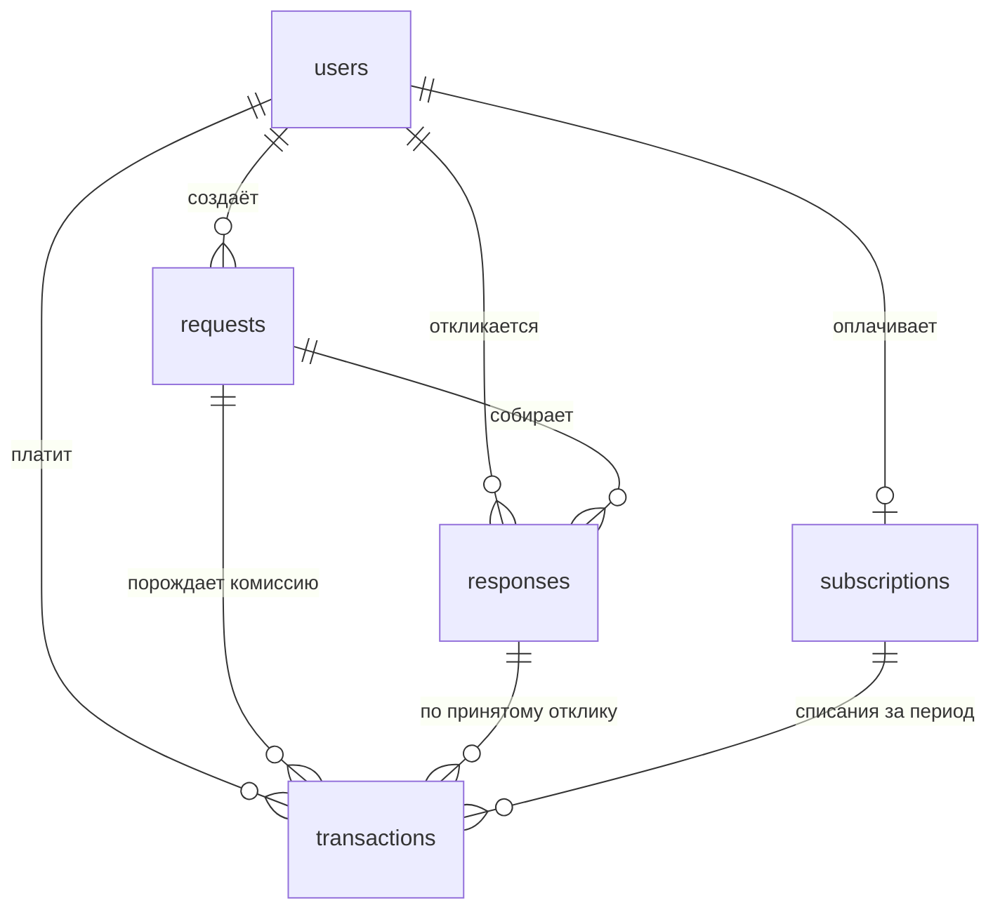

# OPUS GROUP

От фото дома до бригады на объекте — конструктор, который строит 3D-модель
дома по фотографиям, считает смету на материалы по ходу редактирования и
подбирает бригаду для монтажа.

See `DESIGN.md` for the design system (color tokens, type scale, layout
wireframe, and the signature landing element).

## Stack

- Next.js (App Router) + TypeScript + Tailwind CSS v4
- `@react-three/fiber` + `@react-three/drei` for the 3D editor canvas
- `zustand` for editor/cart state
- `motion` for the landing hero's photo-to-model reveal
- Self-hosted Unbounded + Manrope (`public/fonts`, `src/app/fonts.css`) — no
  Google Fonts CDN

## 3D provider

The 3D generation vendor (Neural4D) isn't wired up yet. Every screen is
built against the `Model3DProvider` interface in `src/lib/3d/provider.ts`
and runs against `MockModel3DProvider` (`src/lib/3d/mock-provider.ts`),
which returns a believable demo house after a realistic delay. Swapping in
the real vendor later means adding one class and changing the factory in
`src/lib/3d/index.ts` — nothing else in the app touches the vendor
directly. Vendor requests must proxy through a backend route; never call
Neural4D from the browser.

## Getting started

```bash
npm install
npm run dev
```

Open [http://localhost:3000](http://localhost:3000). The editor
(`/editor`) works fully offline against the mock provider — use "Посмотреть
на демо-доме" to skip straight to a generated model.

## Scripts

```bash
npm run dev     # start the dev server
npm run build   # production build
npm run lint    # eslint
npm run db:check # проверить подключение к PostgreSQL
npm run db:migrate        # применить новые миграции
npm run db:migrate:status # посмотреть, что применено, а что нет
npm run db:cleanup        # почистить журнал попыток входа (раз в сутки)
npm run billing:charge    # списать подписки, у которых истёк период (раз в сутки)

npm run demo:seed         # ⚠️ ВРЕМЕННО: тестовые бригады, заявки и отзывы
npm run demo:seed -- --clean   # убрать их
```

⚠️ О временных вставках — отдельный раздел [«Временные
демо-вставки»](#временные-демо-вставки) в конце файла: что добавлено только
для показа функций и как это удалить.

## Где вписать ключ Neural4D

**Локально:** в файле `.env` в корне проекта, строка `NEURAL4D_API_KEY=` —
впишите значение сразу после `=`, без кавычек и пробелов. Файл в git не
попадает. После правки перезапустите dev-сервер: `.env` читается при старте.

**На Vercel:** Settings → Environment Variables → `NEURAL4D_API_KEY`.
Никакого префикса `NEXT_PUBLIC_` — с ним Next подставит значение в
браузерный бандл, и ключ увидит любой посетитель.

Пока ключ пуст, `/api/neural4d/generate` отвечает `{ configured: false }`, и
приложение работает на демо-модели — то есть пустой `.env` ничего не ломает.

### Как устроена защита

- `NEURAL4D_API_KEY` читает единственный модуль — `src/lib/server/neural4d-config.ts`.
  Он импортирует `server-only`, поэтому сборка **падает**, если его случайно
  импортировать из клиентского компонента.
- Браузер никогда не обращается к вендору. Фотографии уходят на наш маршрут
  `POST /api/neural4d/generate`, и ключ добавляется там, на сервере.
- Ключ не логируется. В лог пишется только статус ответа вендора; наружу
  уходит обобщённое сообщение, а не тело чужого ответа.
- Адрес вендора задаётся только через окружение и никогда клиентом — иначе
  маршрут стал бы открытым прокси (SSRF).

Проверено «канарейкой»: со подставленным тестовым значением сборка не
содержит его ни в одном файле `.next/static`, а ответы и логи чисты.

## База данных PostgreSQL

Проект подключается к Managed Service for PostgreSQL в Yandex Cloud. Все
настройки — только через переменные окружения, ни одного значения в коде.

**Как настроить локально:**

1. `cp .env.example .env`
2. Заполните в `.env` четыре обязательные строки: `DB_HOST` (FQDN хоста из
   консоли Yandex Cloud, вида `rc1b-xxxxxxxxxxxxxxxx.mdb.yandexcloud.net`),
   `DB_NAME`, `DB_USER`, `DB_PASSWORD`. `DB_PORT` уже стоит `6432` — это порт
   пулера соединений, подключаться нужно через него.

   Хост можно вставлять прямо из адресной строки: `https://` и слэш на конце
   срезаются сами. А вот публичный доступ к хосту должен быть включён
   (Кластер → Хосты → Изменить), иначе имя не существует в публичном DNS и
   подключиться снаружи облака нельзя в принципе.
3. Скачайте корневой сертификат облака и укажите путь к нему в
   `DB_SSL_ROOT_CERT`:

   ```bash
   mkdir -p ~/.postgresql
   curl -o ~/.postgresql/root.crt https://storage.yandexcloud.net/cloud-certs/CA.pem
   ```

4. `npm run db:check` — скрипт делает один тестовый запрос и печатает, к чему
   подключился, или объясняет, что именно не так.

**На Vercel:** те же имена в Settings → Environment Variables. Префикса
`NEXT_PUBLIC_` быть не должно — с ним Next подставит пароль в браузерный
бандл. Файла на диске там нет, поэтому `DB_SSL_ROOT_CERT` не задаётся:
соединение остаётся шифрованным, но без проверки сертификата.

### Как это устроено

- `src/lib/server/db-config.ts` — единственное место, которое читает пароль.
  Импортирует `server-only`, поэтому сборка **падает** при случайном импорте
  из клиентского компонента.
- `src/lib/server/db.ts` — пул соединений (`getPool`, `query`, `pingDatabase`).
  Пул создаётся лениво и переиспользуется между горячими перезагрузками, иначе
  за час разработки был бы выбран лимит соединений базы.
- Запросы всегда параметризованные (`$1`, `$2`), склейки строк с SQL нет —
  значение не может превратиться в код (SQL-инъекция).
- `.env` закрыт `.gitignore` (`.env*`, кроме `.env.example`), поэтому реальный
  пароль в GitHub не попадёт.

## Схема базы и миграции

Схема живёт в `migrations/` — обычные `.sql`-файлы с номерами. Применённые
записываются в таблицу `schema_migrations` в той же базе, поэтому список
применённого не может разойтись с данными при копировании базы.

```bash
npm run db:migrate:status   # что применено, а что ещё нет
npm run db:migrate          # применить всё, что осталось
```

**Правило одно: применённый файл не редактируют.** База помнит его
контрольную сумму и откажется работать, если файл изменился, — иначе правка
молча не доехала бы до сервера, где эта версия уже отмечена выполненной.
Любое изменение схемы — новый файл со следующим номером.

Каждый файл применяется в транзакции: либо целиком, либо база остаётся
нетронутой. Схема, застрявшая на середине файла, чинится руками на живом
сервере — этого допускать нельзя.

### Таблицы



| Таблица | Что хранит | Ключевые правила |
|---|---|---|
| `users` | все люди: `client`, `executor`, `moderator`, `admin` | нужен хотя бы один контакт — почта или телефон; почта уникальна без учёта регистра |
| `requests` | заявки клиентов: что, где, по какой модели дома | модель из редактора лежит целиком в `scene_model jsonb`; опубликованная заявка обязана иметь `published_at` |
| `responses` | отклики исполнителей: цена, срок, сообщение | один отклик от исполнителя на заявку; принятый отклик только один; на свою заявку откликнуться нельзя |
| `subscriptions` | подписка исполнителя (в интерфейсе — «Technic») | одна действующая подписка на человека; доступ проверяется по `current_period_end`, а не по `status` |
| `transactions` | оплата подписок, комиссия со сделок, выплаты, возвраты | `net_amount = gross_amount − commission_amount` проверяется базой; `commission_rate` — доля от суммы, а не проценты; размер ставки схемой не задан |
| `notifications` | уведомления внутри сайта: кому, о чём, прочитано ли | текст пишется готовым на момент события; напоминания о подписке не повторяются в те же сутки (частичный уникальный индекс) |

Деньги — `numeric(14, 2)`, никогда `float`: `double precision` хранит `0.1`
приблизительно, и на сотне комиссий сумма разъезжается с бухгалтерией.
Ставка комиссии хранится вместе с суммой, а не берётся из настроек при
чтении: ставка со временем меняется, и пересчёт старых сделок по новой
ставке испортил бы прошлые отчёты.

Удаление людей — `ON DELETE RESTRICT`: заявка без автора и платёж без
плательщика ломают отчётность. Ушедший пользователь получает
`status = 'deleted'`, строки остаются.

## Регистрация, вход и роли

```
POST /api/auth/register   почта + пароль + роль (только client или executor)
POST /api/auth/login      выдаёт сессию
POST /api/auth/refresh    продлевает её, перечитывая роль из базы
POST /api/auth/logout     отзывает сессию
GET  /api/auth/me         профиль текущего пользователя
```

Перед первым запуском задайте `AUTH_JWT_SECRET` в `.env`:

```bash
openssl rand -base64 48
```

Тот, кто знает этот секрет, может выписать себе токен с ролью `admin` — это
такой же секрет, как пароль от базы.

### Как устроен вход

**Пароли** хранятся как bcrypt-хеш со стоимостью 12
(`src/lib/server/auth/password.ts`), никогда в открытом виде. bcrypt выбран
потому, что он нарочно медленный: SHA-256 видеокарта считает миллиардами в
секунду и проходит словарь популярных паролей за доли секунды, а здесь один
хеш занимает ~0,3 с.

**Токенов два**, и это главное решение:

| | access | refresh |
|---|---|---|
| что это | JWT, подпись HS256 | 32 случайных байта |
| живёт | 15 минут | 30 дней |
| проверяется | подписью, без запроса к базе | по хешу в `auth_sessions` |
| можно отозвать | нет | да |

Подписанный JWT нельзя отозвать: после «выйти» или блокировки он работает до
конца своего срока. Поэтому он короткий, а продление идёт через
refresh-токен, который лежит в базе и помечается отозванным. Отзыв
срабатывает в пределах 15 минут — это цена за то, что обычная проверка не
ходит в базу на каждый запрос.

JWT **не зашифрован**: содержимое читает кто угодно, подпись защищает только
от подмены. Поэтому внутри лежат лишь id, роль и id сессии — ни почты, ни
телефона.

**Токены — в cookie с `httpOnly`**, не в `localStorage`: такой cookie
недоступен из JavaScript, поэтому чужой скрипт на странице (XSS) не может его
прочитать. Refresh-cookie ограничен путём `/api/auth`, чтобы длинный токен не
уходил с каждым запросом.

### Проверка роли

Каждый защищённый обработчик начинается одинаково:

```ts
export async function GET() {
  const auth = await requireRole(["moderator", "admin"]);
  if (!auth.ok) return auth.response;   // 401 или 403
  // здесь auth.user точно есть и точно нужной роли
}
```

Проверка стоит **в самом обработчике**, рядом с данными. `src/proxy.ts`
(в Next 16 так теперь называется бывший `middleware.ts`) только уводит гостя
со страницы на форму входа — он смотрит лишь на наличие cookie и защитой не
является. Защита снаружи выглядит работающей ровно до первого маршрута,
который забыли внести в `matcher`.

`401` — «не знаю, кто ты», клиент идёт за новым токеном и повторяет запрос.
`403` — «знаю, но нельзя», повторять бессмысленно.

### Ограничение частоты попыток входа

bcrypt делает перебор медленным, но не невозможным: ~0,3 с на хеш — это три
пароля в секунду с одной машины и триста с сотни. Словарь из миллиона
популярных паролей при таком темпе проходится меньше чем за час. Поэтому
пределов два, и они разные по назначению:

| предел | сколько | зачем |
|---|---|---|
| на адрес почты | 5 неудач за 15 минут | прицельный подбор одного аккаунта |
| на адрес источника (IP) | 20 неудач за 15 минут | «распыление»: по одному паролю к тысяче аккаунтов |

Пять — потому что живой человек ошибается два-три раза (не та раскладка,
Caps Lock, старый пароль), а перебору это оставляет 480 попыток в сутки
вместо десятков миллионов. Двадцать на IP — заметно свободнее, потому что
офис, кафе и мобильный оператор выпускают в интернет сотни людей через один
адрес, и строгий предел заблокировал бы всех из-за одного забывчивого.

Окно скользящее: оно не сбрасывается разом, а «стекает», поэтому после
ожидания открывается одна попытка, а не сразу пять. Удачный вход стирает
накопленные неудачи. Ответ на превышение — `429` с заголовком `Retry-After`.

Предел применяется одинаково к существующим и выдуманным адресам — иначе он
сам стал бы способом узнать, кто зарегистрирован («этот отвечает 429, а этот
401»). Счётчик живёт в PostgreSQL (`login_attempts`), а не в памяти процесса:
на Vercel запросы расходятся по нескольким копиям приложения, у каждой был бы
свой счётчик, и предел множился бы на их число.

**Обратная сторона:** пока адрес заблокирован, не входит и настоящий владелец
— значит, зная чужую почту, можно намеренно закрыть человеку вход на 15 минут.
Это осознанный размен: альтернатива (не ограничивать вовсе) хуже. Блокировка
временная и снимается сама.

Журнал попыток растёт с каждым входом — `npm run db:cleanup` удаляет записи
старше суток. Стоит поставить на ежедневный запуск (Cron Job на Vercel).

### Страницы

- `/login` — вход и регистрация, переключаются вкладками.
- `/cabinet` — профиль и выход. Закрыт: гостя уводит на `/login?next=/cabinet`.

### Автоматическое продление сессии

Запросы из браузера идут через `useApiFetch` (`src/lib/auth/`). Получив `401`,
он один раз зовёт `/api/auth/refresh` и повторяет исходный запрос — человек
ничего не замечает. Если продлить нечем (вышли, заблокировали, истекли 30
дней), уводит на `/login?next=…`.

Два места, где легко ошибиться:

- **Повтор ровно один.** Токен только что обновлён; если и повтор вернул
  `401`, дело не в сроке, и второй заход лишь устроит бесконечный цикл.
- **Одно продление на всех.** Страница шлёт несколько запросов разом, и все
  получают `401` одновременно. Без общего обещания каждый пошёл бы продлевать
  сам — а refresh-токен при продлении заменяется, поэтому второе продление
  пришло бы с уже отозванным токеном и выкинуло человека из аккаунта.

Глобальный `fetch` намеренно не подменяется: под такой перехват попали бы
запросы самого Next и сторонних библиотек. Навигация живёт в хуке, а не в
сетевом модуле, — `window.location` из недр сетевого слоя перезагружал бы
приложение целиком.

## Заявки

```
GET  /api/requests                      клиенту — свои, исполнителю — лента новых
POST /api/requests                      создать (только client)
GET  /api/requests/{id}                 заявка с откликами
POST /api/requests/{id}/responses       откликнуться (только executor)
POST /api/responses/{id}/accept         принять отклик (только владелец заявки)
POST /api/requests/{id}/status          завершить или отменить (только владелец)
```

Путь заявки:

```
Новая ──принят отклик──▶ В работе ──клиент подтвердил──▶ Завершена
  │                          │
  └────────Отменена ◀────────┘
```

Переходы заданы таблицей в `src/lib/server/requests/status.ts`, а не
россыпью `if` по обработчикам: правило «завершённую нельзя отменить»
читается с одной строки. В базе есть пятый статус `draft` — место под
черновики оставлено в схеме, но через API он пока не выдаётся.

### Что здесь важно

**Роль — не право на конкретную строку.** `requireRole(["client"])` отвечает
на вопрос «клиент ли ты вообще», но не «твоя ли это заявка». Без второй
проверки любой клиент завершил бы чужую заявку, зная её id. Владелец
сверяется прямо в запросе (`where client_id = $2`), а не отдельным чтением:
между чтением и записью состояние успевает измениться.

**Подтверждает выполнение клиент, а не исполнитель** — иначе исполнителю
хватило бы нажать «готово», чтобы работа считалась принятой.

**Принятие отклика — одна транзакция:** отклик становится принятым, остальные
отклонёнными, заявка уходит в работу. Оборвись связь посередине — заявка
осталась бы «новой» с уже принятым откликом. Строка заявки при этом
блокируется (`for update`), иначе два одновременных подтверждения оба
прочитали бы «новая» и оба прошли бы проверку.

**Исполнитель видит только свой отклик** на чужой заявке: чужие цены — чужая
коммерческая информация, по ней подстраивают собственную.

## Платежи: Т-Касса

Интернет-эквайринг Т-Банка. **Реквизиты карты к нам не попадают никогда** —
человек вводит их на странице банка, мы обмениваемся только суммами и
номерами платежей. Поэтому приложение не подпадает под требования к хранению
карточных данных (PCI DSS).

По умолчанию приём платежей **выключен** (`TKASSA_ENABLED=false`): забытый в
окружении ключ не должен начать списывать деньги сам.

```
POST /api/subscriptions/checkout        исполнитель начинает оплату → ссылка на банк
POST /api/payments/tkassa/webhook       уведомления банка (без входа, по подписи)
npm run billing:charge                  ежемесячные списания, ставить на cron
```

### Кто и за что платит

Подписка — для **исполнителей**: она снимает ограничение на отклики и
отмечает бригаду в выдаче. Заказчику платить не за что.

**Первый отклик бесплатный, второй и дальше — по подписке.** Смысл в том,
чтобы исполнитель попробовал площадку по-настоящему: один отклик — это одна
реальная сделка, после которой уже понятно, стоит ли платить.

Проверка живёт **внутри самой вставки отклика**, а не запросом перед ней:
между «проверили, что можно» и «записали» помещается второй такой же запрос,
и без подписки прошли бы два бесплатных отклика вместо одного. Считаются все
когда-либо созданные отклики, включая отозванные, — иначе «отозвать и
откликнуться снова» стало бы бесконечным бесплатным тарифом.

Упёршийся в лимит получает `402 Payment Required` и в кабинете видит не
красную плашку, а развилку: «Первый отклик бесплатный, для следующих нужна
подписка» со ссылкой на оплату.

Экран оплаты — `/subscribe`. До него кнопка «Оформить подписку» на главной
вела на `/start`, экран выбора, что строить: тарифный блок написали раньше,
чем появилась оплата, вести было некуда, и кнопку скопировали с соседней
«Начать бесплатно».

**Страница открыта всем, включая гостей.** Сначала она была закрытой, и
второй заход по той же кнопке приводил гостя на форму входа — он уходил, так
и не узнав, за что предлагают заплатить. Витрину тарифа закрывать нечем:
цена и список возможностей одинаковы для всех, а платит всё равно тот, кто
вошёл, — маршрут оплаты проверяет права сам. Гость видит то же предложение и
кнопку «Войти и оформить»; заказчик — объяснение, почему ему платить не за
что; исполнитель — цену и кнопку оплаты.

Пока ключи Т-Кассы не заданы, кнопка оплаты **неактивна и говорит, почему**:
«приём платежей ещё не подключён». Раньше она выглядела рабочей и отвечала
красным «Оплата пока не подключена» — на вид поломка, хотя это ожидаемое
состояние до появления реквизитов ИП.

### Как устроено автосписание

1. Исполнитель нажимает «Оформить». Мы заводим строку платежа, её id уходит
   банку как `OrderId`, и человек уходит на страницу оплаты.
2. Платёж создаётся с `Recurrent: "Y"` — «запомнить карту». После успешной
   оплаты банк присылает `RebillId`; мы кладём его в `subscriptions`.
   Это не номер карты: по нему можно только списать через наш же терминал.
3. Дальше `billing:charge` раз в сутки берёт подписки с истёкшим периодом и
   списывает следующий месяц по `RebillId` — человека никуда не отправляют.

Раз в сутки, а не раз в месяц: «раз в месяц» — это один шанс в году что-то не
заметить, а ежедневный запуск сам догоняет пропущенное.

Если списание не прошло, подписка помечается `past_due`, но **доступ сразу не
отбирается**: карту могли перевыпустить, денег могло не хватить один день.
Через трое суток период истекает сам.

### Вебхук

Единственный маршрут без проверки входа — и так и должно быть: сюда стучится
банк, у которого нет нашей сессии. Вместо входа здесь **подпись**: SHA-256 от
значений параметров, отсортированных по имени ключа, с добавленным паролем
терминала. Без этой проверки вебхук был бы открытой дверью — кто угодно
прислал бы «платёж прошёл» и получил подписку даром.

Два свойства, без которых всё разваливается:

- **Повторное уведомление не продлевает подписку второй раз.** Банк повторяет
  уведомления при любой заминке в ответе; без защиты человек получил бы
  шестьдесят дней за одну оплату. Строка платежа блокируется (`for update`) и
  переходит в `succeeded` только из `pending`.
- **На свою ошибку отвечаем `500`, на чужую — `OK`.** `500` заставляет банк
  повторить, и это правильно, когда у нас упала база. Но на мусорный
  `OrderId` повтор ничего не исправит — там `OK`, иначе банк будет стучаться
  сутками.

## Комиссия

Считается при завершении заявки, **той же транзакцией**: завершённая заявка
без строки в учёте — это недостача, которую обнаружат при сверке в конце
квартала, когда восстанавливать сумму уже неоткуда.

```
комиссия = агентское вознаграждение (фикс.) + доля от суммы сделки
исполнителю = сумма сделки − комиссия
```

Обе части настраиваются окружением и **по умолчанию нулевые**:

| переменная | что это |
|---|---|
| `COMMISSION_AGENT_FEE` | фиксированная сумма за сделку, в рублях |
| `COMMISSION_RATE` | доля от суммы: `0.07` — это 7% |

Ноль по умолчанию выбран сознательно: значение «как обычно берут» означало бы,
что забытая настройка молча удерживает деньги у исполнителей.

Арифметика выполняется **в PostgreSQL**, а не в JavaScript: `165000 * 0.07` в
JS даёт `11550.000000000002`, и это число поехало бы в отчёт. Ставка и обе
части записываются в строку платежа — ставка со временем меняется, а
пересчитывать прошлые сделки по новой нельзя, это переписало бы сданную
отчётность.

Отклик без цены («по смете объекта») комиссии не порождает: её сумма нам
неизвестна.

### Чего пока нет

- Чеков по 54-ФЗ (`Receipt` в запросе к банку) — нужны при работе с
  физлицами, добавляются вместе с онлайн-кассой.

## Модерация

`/moderation` — для ролей `moderator` и `admin`. Пункт «Модерация» появляется
в меню сайта только у них.

Роль читается из cookie `opus_role` **в браузере** (`useRoleCookie`), а не на
сервере. Она же решает, что написать на кнопке входа в шапке: гостю «Войти» на
`/login`, вошедшему «Кабинет» на `/cabinet`. Серверный снимок — «не вошёл»,
поэтому в статической разметке лежит «Войти»: гости видят верную кнопку сразу,
а вошедшим она сменится после гидратации. Причина: серверная проверка сделала бы динамическими все страницы с
этим меню, включая главную, — она отдаётся готовой с CDN, и терять это ради
ссылки для двух человек не стоит. В статической разметке ссылки нет вовсе,
поэтому в общий кеш она не попадает.

Эта cookie — **подсказка интерфейса, а не право**. Она единственная без
`httpOnly` (меню обязано её прочитать), значит её можно подделать: подделавший
увидит лишний пункт и получит по нему разворот на форму входа. Права
проверяются на сервере в трёх местах, и ни одна проверка в эту cookie не
смотрит: `src/proxy.ts`, страница `/moderation` и каждый маршрут
`/api/moderation/*` — везде роль берётся из подписанного токена.

**Решение без причины не сохраняется.** Причина не пожелание, а часть
решения: 289-ФЗ требует, чтобы ограничение доступа можно было объяснить тому,
кого ограничили. Требование стоит в трёх местах сразу — кнопка не активна,
пока причина не написана; сервер проверяет её сам; и в базе висит
`check (length(btrim(reason)) >= 10)`. Интерфейс убеждает, сервер обязывает,
база гарантирует.

Смена статуса и запись причины идут одной транзакцией — иначе появляется
заблокированный пользователь без объяснения, то есть ровно то, чего закон и
требует избегать. Причина последнего решения показана прямо в карточке:
модератор, снимающий блокировку, должен видеть, за что она была наложена.

Блокировка **закрывает все сессии** пользователя. Без этого он продолжал бы
работать до конца жизни своего токена, и «заблокирован» осталось бы словом.

## Профили исполнителей

Захардкоженный список бригад (`src/lib/crews.ts`) удалён — страница
«Бригады» показывает реальных исполнителей из базы: навыки, описание,
ориентир по цене, портфолио.

**Рейтинг не хранится, а считается** из завершённых заявок при каждом
запросе. Хранимое число пришлось бы пересчитывать при каждом изменении
заявки, и рано или поздно оно разошлось бы с реальностью — такие поля всегда
врут после первой же забытой ветки кода.

Звёзд больше нет, и это осознанно. Звезда требует отзывов, а отзывов мы пока
не собираем: «★ 4.9» без единого отзыва — картинка, вводящая заказчика в
заблуждение. Показывается то, что известно из базы: сколько заявок бригада
довела до «завершена» и какая доля принятых сделок сорвалась. У новичка
написано «пока без завершённых заявок», а не ноль звёзд, который читается как
«плохой».

## Подтверждение почты и восстановление пароля

```
POST /api/auth/verify-email      прислать письмо со ссылкой
PUT  /api/auth/verify-email      подтвердить по ссылке
POST /api/auth/password-reset    прислать ссылку для смены пароля
PUT  /api/auth/password-reset    задать новый пароль
```

Ссылки одноразовые, хранятся как SHA-256 (сам токен — только в письме).
Подтверждение почты живёт сутки, сброс пароля — час: письмо о сбросе самая
лакомая цель, и каждый лишний час его жизни это лишний час чужой
возможности. Выдача новой ссылки гасит предыдущие.

Запрос сброса отвечает **одинаково** и для существующего адреса, и для
выдуманного — иначе форма «забыли пароль» превращается в справочник
зарегистрированных. Смена пароля закрывает все сессии: пароль меняют в том
числе тогда, когда его увели.

**Почтовый сервис пока не подключён.** Пока `SMTP_URL` не задан, письмо
печатается в лог сервера вместе со ссылкой — и подтверждение, и
восстановление работают полностью, просто ссылку берут из лога. Интерфейс
говорит об этом прямо, а не рисует «письмо отправлено» в пустоту.

## Журнал обращений к персональным данным (152-ФЗ)

Каждый показ **чужих** персональных данных пишется в
`personal_data_access_log`: кто, чьи, какие поля, когда и зачем. Сейчас это
список пользователей в модерации; при добавлении новых мест — та же функция
`logPersonalDataAccess`.

В журнале хранятся **имена полей, а не значения**. Журнал, куда сложили копию
персональных данных, — это вторая база персональных данных, которую тоже надо
защищать, и утечка из неё ничем не лучше первой.

Свои же данные в журнал не пишутся: человек вправе смотреть их сколько
угодно, и эти строки только мешали бы найти чужие обращения.

Срок хранения — год, чистится `npm run db:cleanup`: тот же закон требует не
хранить данные дольше, чем нужно для цели, а цель журнала — разбор
инцидентов, а не летопись.

### Чего пока нет здесь

- Экрана «кто смотрел мои данные» — функция `listAccessLog` готова,
  страницы нет.
- Согласия на обработку персональных данных при регистрации и политики
  обработки: это документы, а не код.

## Кабинет: история активности

Заказчик видит свои заявки — статус, число откликов, дата, — фильтр по
статусу и заголовок-ссылку на страницу заявки.

Исполнитель видит **два списка, а не один**. «Моя работа» — заявки, где его
отклик приняли; «Мои отклики» — все, включая отклонённые. Отклик — это
заявка о себе, принятая заявка — обязательство; смешанные в кучу, они
заставляют каждый раз глазами отделять «я предложил» от «я должен сделать»,
а это ровно те две вещи, за которыми в кабинет и приходят.

Отклонённые отклики не прячутся: «откликался, не выбрали» — факт, который
человек имеет право видеть. В списке, где неудачи молча исчезают, остаётся
ощущение, что отклик просто не отправился.

Фильтр — строчкой, а не выпадающим списком: статусов пять, все помещаются в
строку, и число рядом с подписью отвечает на «а есть ли там что-нибудь»
раньше, чем человек успеет нажать. Пустые статусы не показываются, при одном
статусе фильтр исчезает целиком. Сортировка везде одна — сначала новые;
отдельного переключателя нет намеренно, «сначала старые» в списке заявок
нужно примерно никогда.

### Страница заявки `/requests/[id]`

До неё заявка жила только внутри карточки в списке: ни переслать ссылку, ни
вернуться. Правила видимости повторены **на самой странице**, а не
унаследованы от маршрута API: страница ходит в базу напрямую, и проверка,
оставшаяся только в маршруте, её бы не защитила.

| Кто | Что видит |
|---|---|
| заказчик-владелец | заявку и все отклики |
| исполнитель | заявку и **только свой** отклик — чужие цены это чужая коммерческая информация |
| посторонний | 404, даже если заявка существует |

Действия (принять отклик, завершить, отменить) остались в кабинете:
дублировать их здесь значит завести второе место, где они могут разойтись.

## Переписка внутри заявки

Чат заказчика и принятого исполнителя, привязанный **к заявке, а не к паре
людей**. Одна и та же бригада может делать заказчику крышу и забор, и «где
мы там про вентзазор договаривались» — вопрос, на который отвечает заявка, а
не лента сообщений двух человек за год.

**Право писать нигде не хранится** — оно выводится из состояния заявки при
каждом запросе: заказчик и исполнитель принятого отклика, пока заявка в
работе или завершена. Хранимый список участников пришлось бы обновлять при
каждом принятии, отклонении и отмене, и он разошёлся бы с заявкой на первом
же забытом месте.

То же правило продублировано триггером в базе (миграция `0011`). Это не
перестраховка: проверка в коде обходится запросом мимо интерфейса, а
переписка о деньгах и сроках — ровно то, что посторонним читать нельзя.
Проверено прямо: вставка от отклонённого исполнителя через psql, мимо всего
приложения, отвергается базой.

| Кто | Читает | Пишет |
|---|---|---|
| заказчик и принятый исполнитель, заявка в работе или завершена | да | да |
| они же, заявка отменена | да | нет |
| они же, отклик ещё не принят | да, пусто | нет |
| отклонённый исполнитель, посторонний | 404 | 404 |

Отменённая заявка оставляет переписку доступной для чтения: стереть историю
разговора у человека, с которым не сложилось, — это и есть способ потерять
доказательства.

Уведомление собеседнику создаётся **той же транзакцией**, что и сообщение, и
ведёт прямо на заявку, а не в кабинет: разговор там, и «откройте кабинет и
найдите заявку» — два лишних шага до текста, который человеку и показывали.

Живого соединения нет: сообщения подтягиваются опросом раз в десять секунд,
пока вкладка видима. WebSocket для чата на две реплики в час — это отдельный
сервер, который надо держать живым, и он тут не окупается; когда переписка
станет оживлённее, меняется одна функция, а не весь компонент.

### Прочитано

`read_at` датой, а не флагом «да/нет»: она отвечает и на вопрос «когда»,
который всплывает в разборе «я вам писал ещё во вторник».

Гасит непрочитанное не отрисовка страницы, а сам чат — когда доезжает до
экрана (`IntersectionObserver`). Заявка длинная, переписка может остаться
далеко внизу, и считать её прочитанной только потому, что страницу открыли,
было бы неправдой. Счётчик для вкладки при этом берётся **до** того, как
чат откроют, иначе он всегда показывал бы ноль.

Помечаются прочитанными только сообщения собеседника. Своё автору помечать
незачем — он его и так видел, — а поставив дату себе, мы сообщили бы
собеседнику «прочитано» в тот момент, когда он ещё ничего не открывал.
«✓✓» показывается тоже только на своих: знать, прочитал ли ты сам то, что
видишь перед собой, не нужно.

Сообщение нельзя изменить или удалить — как и отзыв. Спор «я такого не
писал» разбирается по строкам, которые нельзя переписать. Запрет при этом
точечный (миграция `0015`): менять можно **только** `read_at` и только один
раз, с NULL на дату. Изначально в `0011` запрет был на любое `UPDATE`, и
под него попала сама отметка о прочтении — отметка это не правка сообщения,
а факт о нём. Прочитанное остаётся прочитанным: снять отметку нельзя, иначе
«вы прочли» снова превращается в предмет спора.

### Вкладка «Чат»

На странице заявки, ссылкой-якорем, с числом непрочитанных. Видна только
участникам: у постороннего её нет ни в разметке, ни на сервере.

Вкладки сделаны ссылками, а не переключением на скрипте, намеренно: обе
части нужны одновременно — читая переписку, человек сверяется с ценой из
отклика, — и прятать одну за другой значит заставлять его прыгать туда-сюда.
Ссылка при этом делает ровно то, чего от вкладки ждут: показывает, что
раздел есть, и уводит к нему одним кликом.

## Отзывы и рейтинг

> ⚠️ **Сейчас это правило временно ослаблено для проверки.** Отзыв может
> оставить любой вошедший пользователь о любом исполнителе, без завершённой
> заявки. Ниже описано, как должно работать и как будет работать после
> отката — см. раздел [«Временные демо-вставки»](#временные-демо-вставки),
> пункт 4.

Клиент оставляет отзыв в кабинете, на карточке завершённой заявки: оценка
1–5 и необязательный текст. Оценка обязательна, текст нет — расписывать
почему это работа, и требовать её значит не получить ни одного отзыва.

**Все правила держит база, а не приложение** (миграция `0006`). Проверка в
коде обходится запросом мимо интерфейса, скриптом переноса или админкой, а
накрученный рейтинг — это чужие деньги, потому что по нему выбирают.

| Правило | Чем держится |
|---|---|
| один отзыв на заявку | `unique (request_id)` |
| только своя завершённая заявка | триггер `reviews_check_eligibility` |
| только о том исполнителе, чей отклик приняли | тот же триггер |
| оценка 1–5 | `check (rating between 1 and 5)` |
| отзыв нельзя переписать или удалить | триггер `reviews_forbid_rewrite` |

Последнее правило стоит на самом действии, а не на роли: приложение ходит в
базу одним пользователем, и «нельзя исполнителю» на уровне СУБД не
выражается. Поэтому `update` и `delete` по таблице отвергаются кем угодно —
исполнитель не уберёт неудобный отзыв о себе никаким путём. Понадобится
модерация отзывов — она придёт отдельной миграцией, которая заменит этот
триггер на разбор того, кто именно правит.

Исполнитель по чужой заявке отзыв тоже не напишет: маршрут закрыт
`requireRole(["client"])`, а даже с ролью клиента триггер потребует, чтобы
заявка была его собственной.

**Средний рейтинг нигде не хранится** — считается по таблице при каждом
запросе, как и счёт завершённых сделок. Хранимое число пришлось бы
пересчитывать при каждом новом отзыве, и оно разошлось бы с реальностью
после первой же забытой ветки кода.

У исполнителя без отзывов написано «пока нет отзывов», а не пять пустых
звёзд: пустые звёзды читаются как «плохой», хотя его просто ещё никто не
нанимал. Рейтинг и доля завершённых сделок показаны двумя строками, а не
одним числом — это разные вещи: первое мнение заказчиков, второе факт из
базы, и слепить их значит выдать оценку там, где её никто не ставил.

Порядок выдачи бригад по рейтингу **не меняли**: у этого своя цена — новичок
без отзывов проваливался бы в конец и не получал первую работу, с которой у
него только и может появиться первый отзыв.

## Уведомления внутри сайта

Колокольчик в шапке с числом непрочитанных; по клику — список, свежие
сверху; клик по строке гасит её и уводит туда, где событие произошло.
Почты пока нет — и это не мешает: показанное в интерфейсе доходит надёжнее
письма. Когда почта появится, она станет вторым каналом для тех же строк.

| Событие | Кому | Тип |
|---|---|---|
| исполнитель откликнулся | клиенту | `response_received` |
| отклик принят | исполнителю | `response_accepted` |
| выбрали другого | остальным откликнувшимся | `response_rejected` |
| клиент принял работу | исполнителю | `request_completed` |
| заявка отменена | всем, кто по ней ждал ответа | `request_cancelled` |
| подписка скоро кончится / кончилась | исполнителю | `subscription_expiring`, `subscription_expired` |

**Уведомление создаётся той же транзакцией, что и событие.** Не «после того,
как отклик записан», а вместе с ним: иначе сбой между двумя запросами
оставляет отклик, о котором клиенту не сообщили, — и клиент видит «никто не
откликнулся», хотя откликнулись. Проверено прямо: если вставка в
`notifications` падает, отклик не появляется вовсе.

Поэтому `createNotifications` принимает клиента открытой транзакции, а не
работает сам по себе — записать событие, забыв про уведомление, снаружи
невозможно.

Самому себе уведомлений не приходит: клиент, отменивший заявку, и так знает,
что он её отменил. Сообщать человеку о его собственном действии — шум,
который приучает не открывать колокольчик вовсе.

Напоминания о подписке шлёт ежедневный `npm run billing:charge` — тот же
запуск, что делает списания. Повтор в те же сутки гасит частичный уникальный
индекс, а не переменная «когда предупреждали в прошлый раз»: индекс
переживает перезапуск скрипта и второй запуск за день.

Счётчик непрочитанных считается отдельным запросом, а не по длине выданного
списка: непрочитанных бывает больше, чем влезло в выдачу, и «3» на
колокольчике при пяти непрочитанных — это неправда.

Пометить чужое уведомление прочитанным нельзя: владелец сверяется в самом
`update` (`where user_id = $2`), а не отдельным чтением. Роль отвечает на
вопрос «вошёл ли ты», но не на вопрос «твоё ли это».

Колокольчик показывается только вошедшим — по той же cookie с ролью, что и
кнопка «Кабинет». Cookie подделывается, и это учтено: подделавший получит от
`/api/notifications` пустой список, потому что маршрут смотрит на подписанный
токен, а не на неё.

## Приветствие после регистрации

Карточка в духе «достижения» — золотая плашка снизу справа с медалью,
поздравлением и одной кнопкой «что делать дальше», разной под роль:
заказчику «Создать заявку», исполнителю «Заполнить профиль», модератору
«Открыть модерацию».

**Показывается ровно один раз**, и хранителем этого «одного раза» служит не
localStorage, а строка в `notifications` с типом `welcome`. localStorage
чистится в два клика и не переезжает на второе устройство: человек, которому
приветствие показали на телефоне, встречал бы его снова на ноутбуке.
«Показано» — это `read_at`, тот же признак, что у всех остальных
уведомлений, и помечается он тем же маршрутом.

Приветствие создаётся **той же транзакцией, что и учётная запись**. Здесь у
этого правила есть дополнительный смысл: второго первого входа не будет, и
момент, когда приветствие вообще можно создать, ровно один.

Один человек — одно приветствие, и держит это база: частичный уникальный
индекс `notifications_welcome_once_idx`. «Создаём только при регистрации» —
обещание кода, а обещания кода обходятся повторным запуском сида, ручной
вставкой и любым будущим «а давайте покажем приветствие и тем, кто
регистрировался раньше».

Текст пишется готовым под роль на момент регистрации — как и у остальных
уведомлений. Роль человек может сменить (а в демо-режиме ещё и кнопкой), и
приветствие, собираемое при показе, рассказывало бы про сегодняшнюю роль, а
не про ту, с которой он пришёл.

Карточка живёт в корневой разметке, то есть на всех страницах: после
регистрации с `?next=` человек попадает не обязательно в кабинет, и застать
его надо там, где он оказался. Гостю она ничего не рисует и никуда не ходит
— решает по той же cookie с ролью, что и кнопка «Кабинет».

Зарегистрировавшиеся **до** этой миграции приветствия не увидят: строки у них
нет, и задним числом она не создаётся. Показывать «добро пожаловать» тому,
кто ходит сюда месяц, — не поздравление, а сбой.

Мелочь, которая стоила отдельного решения: приветствие помечается показанным
**сразу при появлении**, а не при закрытии. Иначе человек, ушедший со
страницы не нажав ничего, встретил бы его снова, и «один раз» превратилось
бы в «пока не закроешь».

## Рейтинг товаров

### Фильтр «Оценка»

В магазине рядом с категорией и производителем — гистограмма: сколько
товаров в каждой полосе оценки. Каждая строка кнопка: нажатие оставляет
только эту полосу, повторное снимает.

Гистограммой, а не строкой чипов «5 ★ / 4 ★ / 3 ★». Чипы сказали бы
только, что фильтр есть; столбики отвечают на «а есть ли там вообще
что-нибудь ниже четвёрки» раньше, чем человек нажмёт.

**Полосы не накопительные:** «4 ★» — это 3,5–4,49, а не «четыре и выше».
Накопительные привычнее по маркетплейсам, но они врут глазу: столбик у
двойки включал бы в себя весь каталог, и картинка показывала бы не разброс
оценок, а порядок сортировки. Здесь столбики — настоящая форма каталога.

Товары без единого отзыва — своя полоса «—», а не «единица»: «никто не
оценил» и «оценили на единицу» разные новости, складывать их нельзя. Пустые
полосы не показываются вовсе, а при одной полосе на весь каталог группа
исчезает целиком — фильтровать не по чему.

Средняя в подписи взвешена по числу отзывов, а не усреднена по товарам:
простое среднее средних дало бы товару с одним отзывом тот же вес, что
товару с девятью.

Фильтрация по оценке живёт на странице, а не в `filterProducts`: та —
чистая функция над каталогом-файлом, а рейтинги приезжают из базы отдельным
запросом, и тащить сеть внутрь неё значит лишить её этой чистоты.


У товаров каталога своя таблица отзывов — `product_reviews`, отдельно от
`reviews`. Это **не дублирование**: две вещи только выглядят одинаково.

| | Отзыв об исполнителе | Отзыв о товаре |
|---|---|---|
| о чём | о работе конкретного человека | о вещи |
| привязан к | завершённой заявке | позиции каталога |
| адресат | строка в `users` | строка каталога (`tn-shinglas-ultra`) |
| «один раз» это | один отзыв **на заявку** — заказчик может нанимать бригаду годами | один отзыв **от человека на товар**: второй был бы правкой первого |

Обслужить оба одной таблицей значило бы завести `executor_id`, у которого
половина строк пустая, и триггер с ветвлением «если это товар, не проверяй
заявку». Такие таблицы перестают отвечать на вопрос «что здесь лежит» на
второй же неделе.

Что у них общее — правила, и они повторены слово в слово: оценка 1–5,
средняя нигде не хранится, переписать и удалить нельзя. Показывает их один
и тот же компонент `RatingLine`: «★ 4,6 · 12 отзывов» в одном месте и
«4.6 (12)» в другом читаются как две разные шкалы, и человек начинает
сравнивать несравнимое.

**Внешнего ключа на товар нет.** Каталог живёт в
`marketplace-catalog.json`, а не в базе, поэтому `product_id` — обычный
текст, и существование товара проверяет приложение по тому же файлу, из
которого рисует страницу. Это осознанная дыра, записанная в миграции `0013`;
когда каталог переедет в базу, здесь появится `references`.

**Каталог остаётся статическим.** Тридцать семь страниц товаров и страница
магазина собираются заранее и отдаются с CDN — это самое ценное, что у
магазина есть. Поэтому оценки не приезжают вместе со страницей, а
подгружаются после отрисовки: один запрос `/api/products/ratings` на все
карточки сразу (тридцать семь запросов по одному числу — это страница,
которая думает секунду вместо десяти миллисекунд), с минутой кеша на общем
кеше. Пока оценка не приехала, строки нет вовсе — а не «пока нет отзывов»:
у товара без единого отзыва и у товара, чью оценку ещё везут, разный смысл.

Если база недоступна, каталог работает без оценок: товары и цены на месте,
отказ уходит в журнал.

## Английская версия (i18n)

Переключатель — **тумблер**: золотая шайба переезжает между RU и EN. Оба
языка видны всегда, поэтому понятно и что выбор есть, и какой сейчас, и куда
приведёт нажатие. Одна буква, молча меняющаяся на другую, не сообщает ничего
из этого — по ней даже не понять, это текущий язык или предлагаемый.

Внутри — **ссылки, а не кнопки**: работает средний клик, видно куда ведёт,
попадает в историю браузера. Кнопка со скриптом не умеет ничего из этого.

### Почему `/en`, а не cookie

Английская версия живёт на отдельных адресах, а не подставляется по cookie
на тех же самых. Три причины, все практические:

1. **Страницы остаются заранее собранными.** Главная отдаётся с CDN готовой;
   страница, которая читает cookie, чтобы выбрать язык, обязана собираться
   на каждый запрос. Проверено по сборке: `/` и `/en` — обе `○ Static`.
2. **Английскую версию можно найти.** У `/en` свой адрес: его индексирует
   поиск, им делятся ссылкой. Язык, спрятанный в cookie, существует только
   для того, кто уже на сайте и уже нажал.
3. **Русские адреса не сломались.** Все существующие ссылки ведут туда же.

Цена — каждая переведённая страница существует дважды в дереве маршрутов.
Содержимое при этом одно: обе ветки рисуют один компонент и отличаются одним
аргументом. Скопировать страницу целиком было бы быстрее ровно один раз — до
первой правки, которую внесут в одну копию и забудут во второй.

В `<head>` проставлены `alternates.languages`, чтобы поиск считал их двумя
версиями одной страницы, а не дубликатом: иначе они конкурируют в выдаче и
обе проседают.

### Что переведено

| | |
|---|---|
| переведено | главная (вместе с тарифами), бригады, **магазин и все 37 страниц товаров**, шапка, подвал, переключатель темы |
| осталось по-русски | кабинет, формы входа и регистрации, смета, конструктор, база знаний |

Каталог переведён **наложением** (`src/lib/i18n/catalog-en.ts`), а не второй
копией `marketplace-catalog.json`. Копия разошлась бы с исходной на первом же
добавленном товаре — и разошлась бы молча, потому что цена, категория и
фотография остались бы в одной, а перевод в другой. В наложении только
текст: названия, описания, характеристики, категории и те названия
производителей, что написаны кириллицей («ТЕХНОНИКОЛЬ» → «TECHNONICOL»).
Латинские бренды в словаре не лежат — «BRAER» читается одинаково на обоих
языках, и вторая запись однажды разошлась бы с первой.

Товара, которого в наложении нет, английская версия покажет по-русски: так
добавленная позиция видна сразу, а не пропадает из каталога без следа на
несколько месяцев.

Цены остаются в рублях на обоих языках — это не язык, а валюта.

**На непереведённой странице переключателя нет вовсе** — список
`TRANSLATED_PAGES` в `src/lib/i18n/locale.ts`. Показать его там значит
пообещать язык, которого не будет: человек нажмёт, получит 404 и решит, что
сломан весь сайт.

Переключатель оставляет человека на той же странице: с `/en/services` он
ведёт на `/services`, а не на главную. Увести с того, что человек читал,
только потому что он сменил язык, — это потерять прочитанное.

Ссылки шапки и подвала тоже знают язык: из английской версии «Crews» ведёт
на `/en/services`, а не на `/services`. Ссылка, тихо возвращающая на
русский, читается как сбой перевода. Исключение — кабинет и вход: они не
переведены, и вести туда с префиксом значило бы то же самое обещание.

**Данные не переводятся.** Названия бригад, города и их описания на
`/en/services` остаются русскими — это то, что написали о себе сами
исполнители, а не текст интерфейса. Машинный перевод чужой визитки — это
уже не перевод сайта.

Ниже 640 px тумблер переезжает из строки шапки в свёрнутое меню: на 390 px
он вместе с надписью и двумя кнопками растягивал документ на 23 px, и экран
начинал ездить вбок.

## Временные демо-вставки

> 📋 Полный список с порядком отката — в отдельном файле
> **[TODO_BEFORE_LAUNCH.md](TODO_BEFORE_LAUNCH.md)**. Здесь — как они
> устроены; там — что и в каком порядке убирать.

**Всё в этом разделе добавлено, чтобы функции можно было посмотреть глазами
до появления настоящих пользователей, и подлежит удалению.** Помечено в коде
значком ⚠️ и словами «ВРЕМЕННАЯ ДЕМО-ВСТАВКА» — `grep -rn "ВРЕМЕННАЯ ДЕМО"`
находит всё разом.

Пункт 4 — ослабленное правило отзывов — **не выключается флагом и живёт в
схеме базы**. Он опаснее остальных и требует отдельного отката миграцией;
подробности ниже.

Пункты 1 и 2 выключены по умолчанию и включаются переменной `DEMO_MODE=true`.
Это не формальность: пункт 2 позволяет любому вошедшему сделать себя
модератором, поэтому забытый в боевом окружении флаг — не «неубранная
демка», а дыра в правах. Без флага маршрут отвечает 404, а не 403: по ответу
не должно быть видно, что где-то есть выключенная возможность повысить себе
права.

### 1. Тестовые отзывы и рейтинги

```bash
npm run demo:seed              # завести
npm run demo:seed -- --clean   # убрать за собой
```

Семь бригад, шестнадцать заказчиков и модератор. Бригады подобраны так,
чтобы показать все случаи рейтинга разом:

| Бригада | Рейтинг | Отзывов | Что показывает |
|---|---|---|---|
| Кровля Урала | ★ 4,6 | 12 | много отзывов, высокая оценка |
| СтройДом Урал | ★ 4,3 | 3 | немного отзывов, хорошая оценка |
| Фасад Плюс | ★ 3,6 | 5 | середина |
| Быстрый монтаж | ★ 2,2 | 6 | низкая оценка |
| Окна и двери 59 | ★ 3,0 | 2 | полярные мнения: 1 и 5 |
| Мастера Прикамья | ★ 5,0 | 1 | «пятёрка» по единственному мнению |
| Новая бригада | — | 0 | «пока нет отзывов», а не ноль звёзд |

Тем же скриптом заводятся отзывы о товарах — **у всех 37 позиций каталога**,
по 2–9 на каждую, всего 120. Разброс подобран как в жизни: 47 пятёрок,
53 четвёрки, 16 троек и по две единицы и двойки, средняя 4,18. Витрина, где
все довольны, ничего не проверяет — на ней не видно ни как выглядит «3,0» в
карточке, ни что делает с рейтингом одна единица.

Крайние случаи оставлены нарочно: `docke-block-house` — ★ 2,0 (низкая
оценка), `rehau-blitz-window` — ★ 3,0 по двум полярным мнениям (1 и 5),
`tn-shinglas-ultra` — ★ 4,7 по девяти отзывам.

Полноту проверяет **сам скрипт**, а не глаза один раз: если у позиции
каталога меньше двух отзывов, сид падает с текстом, какие именно позиции
недобраны. Добавят товар — это станет видно сразу, а не через месяц по
карточке без оценки.

⚠️ Одно следствие, о котором стоит знать: раньше «Новая бригада» намеренно
оставалась без отзывов — на ней было видно состояние «пока нет отзывов», то
самое, ради которого рейтинг не показывают нулём звёзд. Теперь отзывы есть у
всех, и это состояние в демо-данных не встречается нигде. Вернуть его —
очистить `deals` у любой одной бригады в `scripts/seed-demo.ts`.

Пароль у всех `Demo-12345`, вход по `<slug>@demo.opusgroup` (например
`krovlya-urala@demo.opusgroup`), заказчики — `client1…client16`, модератор —
`moderator@demo.opusgroup`. Тексты отзывов начинаются с `[демо]`, почта
заканчивается на `@demo.opusgroup` — по этим меткам они и находятся.

Каждый отзыв — от своего заказчика, а не все от одного. Не ради
правдоподобия: временное правило (пункт 4) разрешает один отзыв от человека
об исполнителе, и десять отзывов от «Демо-заказчика» база просто не примет.

Скриптом, а не миграцией. Миграция описывает **схему** и применяется на
каждой базе один раз и навсегда; тестовые отзывы, приехавшие туда вместе со
схемой, потом ищут руками по всей боевой базе. Скрипт запускают когда хотят,
и он же умеет убрать сделанное.

Отзывы заводятся настоящим путём — заявка → отклик → принятие → завершение →
отзыв. Иначе их не пропустил бы триггер `reviews_check_eligibility`, тот
самый, который не даёт накрутить рейтинг. Заодно это проверка, что правило
работает.

### 2. Переключатель роли модератора

При `DEMO_MODE=true` в кабинете появляется плашка с кнопками «Заказчик ·
Исполнитель · Модератор» — сменить свою роль, не заходя в базу. После смены
выдаётся новая сессия: роль лежит в подписанном токене и «заморожена» на 15
минут, иначе переключение доехало бы через четверть часа.

`admin` в списке нет намеренно: у него шире права, а «на посмотреть» он не
нужен. Чем меньше умеет временный маршрут, тем меньше он стоит, если про
него забудут.

Смотреть на этом экране есть на что: тем же сид-скриптом заводится **очередь
на модерацию** — семь выдуманных людей. Четверо ждут проверки, один активен,
двое заведены уже заблокированными и с записанной причиной: иначе экран
показывает «заблокирован» без объяснения, а по 289-ФЗ ограничение доступа
обязано быть объяснимым.

Блокировка, разблокировка и журнал решений при этом **настоящие** — записи в
базе, та же логика, что будет в бою. Выдуманы только люди.

### 3. Плашка остатка бесплатного тарифа

«Бесплатно: 1 из 1 использовано · Осталось бесплатных: 0» — в кабинете
исполнителя, над лентой заявок, там же, где он откликается.

**Эта плашка помечена временной по вашей просьбе, но временного в ней ничего
нет**, и она единственная из трёх не выключается флагом: числа настоящие, из
того же `readAccessState`, что и серверная проверка лимита. Смысл её в том,
чтобы отказ не был неожиданностью — до неё человек узнавал о лимите после
того, как написал текст отклика и нажал «Отправить». Удалять её стоит только
вместе с заменой на что-то лучшее.

Остаток бесплатных **проектов** в конструкторе показывается отдельно, на
`/start` (`FreeTierNote`) — это другой лимит и другой счётчик.

### 4. ⚠️ Ослабленное правило отзывов

**Это самая опасная из временных вставок. Откатить обязательно до запуска.**

Что снято (миграция `0010_reviews_demo_relax.sql`):

| Было | Стало на время проверки |
|---|---|
| отзыв только по **своей завершённой заявке** | отзыв от любого вошедшего о любом исполнителе |
| один отзыв **на заявку** | один отзыв **от человека об исполнителе** |
| `request_id` обязателен | `request_id` может быть пустым |

Форма для проверки — на карточке бригады в разделе «Услуги», у вошедшего
пользователя, с пунктирной рамкой и словом «временно». Маршрут —
`POST /api/executors/[id]/review`.

Что осталось на месте и после послабления: отзыв нельзя переписать и нельзя
удалить (`reviews_forbid_rewrite`), отзыв самому себе не проходит
(`reviews_no_self`), оценка только 1–5, адресат обязан быть незаблокированным
исполнителем.

Маршрут **не закрыт флагом `DEMO_MODE`** намеренно: закрытый, он не работал
бы там, где его собираются щупать. Цена решения прямая, и её стоит назвать
вслух: **пока это живёт, рейтинг перестаёт быть свидетельством.** Любой
зарегистрировавшийся может поставить конкуренту единицу, ни разу с ним не
работав, — а по этому рейтингу заказчик выбирает, кому доверить крышу.

Побочный эффект, о котором легко забыть: пока действует «один отзыв от
человека об исполнителе», настоящий маршрут `/api/requests/[id]/review`
откажет постоянному заказчику, который нанимает ту же бригаду второй раз.
Это не поломка настоящего правила, а следствие временного — после отката
пройдёт.

**Как откатить.** Полный SQL написан комментарием в шапке
`migrations/0010_reviews_demo_relax.sql` — его нужно скопировать в новый файл
`migrations/0011_reviews_strict.sql` и применить. Функция
`reviews_check_eligibility()` в базе намеренно не удалялась, только триггер:
правило должно вернуться ровно тем же, каким было, а не переписанным по
памяти. Отзывы без заявки при откате удаляются — под строгим правилом таких
не бывает.

### 5. Переключатель «Посетитель / Модератор» в углу

При `DEMO_MODE=true` — плашка снизу слева **на любой странице**, а не только
в кабинете. Тот же маршрут смены роли, что в пункте 2.

Второй такой же переключатель нужен вот зачем: смысл проверки в том, чтобы
увидеть одну и ту же страницу двумя глазами подряд, а не в том, чтобы каждый
раз возвращаться в кабинет и обратно.

Слева снизу, потому что справа снизу живёт приветственная карточка, и два
всплывающих блока в одном углу перекрывали бы друг друга.

**Файлы:** `src/components/demo/DemoModeCorner.tsx`, две строки в
`src/app/layout.tsx`. Без флага плашка не попадает даже в разметку — решение
принимается на сервере.

### 6. Чат с демо-менеджерами из карточки товара

Кнопка «Написать менеджеру» на странице товара открывает переписку с одним
из трёх выдуманных менеджеров поставщиков.

**Правило «переписка только внутри заявки» при этом не ослаблено** — и это
главное решение здесь. Разрешить сообщения без заявки означало бы снять
триггер в базе, то есть открыть переписку кому угодно с кем угодно. Вместо
этого маршрут заводит настоящую заявку «Вопрос по товару …» от имени
спрашивающего, с принятым откликом менеджера. Дальше работает тот же чат, те
же проверки, тот же триггер — трогать их не пришлось вовсе.

Цена решения: в кабинете появляются заявки, которые человек не создавал
руками. Они уходят вместе с демо-данными. Для демонстрации это честнее, чем
дыра в правах.

Собеседник обязан быть демо-менеджером — той же выборкой, что отдаёт список
для кнопки. Без этой проверки маршрут стал бы способом завести переписку с
любым человеком по его id: ровно та дыра, которой мы избегали, только с
другой стороны.

**Файлы:** `src/app/api/demo/manager-chat/`, `src/app/api/demo/managers/`,
`src/components/demo/DemoManagerChat.tsx`, две строки в
`src/components/market/ProductDetail.tsx`.

### Что удалять

| Файл | Пункт |
|---|---|
| `scripts/seed-demo.ts` + строки `demo:seed` в `package.json` | 1 |
| `src/app/api/demo/role/` | 2 |
| `src/lib/demo-mode.ts` | 2, 5, 6 |
| `DEMO_MODE` в `.env.example` | 2, 5, 6 |
| `src/app/cabinet/FreeQuotaNote.tsx` + `renderFreeQuota` в `cabinet/page.tsx` | 3 |
| `migrations/0010_reviews_demo_relax.sql` → откатить файлом `0011` | 4 |
| `src/app/api/executors/[id]/review/` | 4 |
| `createReviewForExecutorDEMO` в `src/lib/server/reviews/queries.ts` | 4 |
| `src/components/demo/DemoReviewForm.tsx` + две строки в `services/ExecutorList.tsx` | 4 |
| `src/components/demo/DemoModeCorner.tsx` + две строки в `src/app/layout.tsx` | 5 |
| `src/app/api/demo/manager-chat/`, `src/app/api/demo/managers/` | 6 |
| `src/components/demo/DemoManagerChat.tsx` + две строки в `market/ProductDetail.tsx` | 6 |

Плюс два импорта и две строки JSX в `src/app/cabinet/page.tsx` — они помечены
там же значком ⚠️.

## Миграции при деплое

Схема догоняется сама: `npm run db:migrate:deploy` стоит первым шагом в
`vercel-build`, и каждый боевой деплой применяет всё, что ещё не применено,
**до** сборки.

```json
"vercel-build": "npm run db:migrate:deploy && next build"
```

Vercel предпочитает `vercel-build` обычному `build`, если такой скрипт есть,
и никаких настроек в панели для этого не нужно. Локальный `npm run build`
при этом остался прежним — он ничего не мигрирует.

### Когда шаг пропускает себя

Половина смысла отдельного скрипта в том, чтобы вовремя **не** сработать.
Три случая, и ни один из них не ошибка:

| Условие | Почему пропускаем |
|---|---|
| переменные PostgreSQL не заданы | так собирается витрина без базы, и так же соберётся форк или превью без секретов. Сайт без базы работает, просто без заявок |
| `VERCEL_ENV` не `production` | превью-сборка ветки применила бы к боевой базе миграции, которые ещё никто не смотрел. Схема уехала бы вперёд кода |
| применять нечего | обычное состояние: код меняется чаще схемы |

Вне Vercel переменной `VERCEL_ENV` нет вовсе, и это **не** повод пропускать:
запустили руками — значит хотели.

### Когда шаг валит сборку

Упавшая миграция останавливает деплой. Это не строгость ради строгости:
выкатить код, который ждёт колонки, которой нет, — это пятисотые у живых
людей вместо красной сборки, которую видит один человек.

Аварийный выключатель на случай «миграция ломает сборку, а выкатить надо
сейчас» — переменная `SKIP_DEPLOY_MIGRATIONS=1` в настройках проекта Vercel.
Деплой пройдёт без миграций, схему придётся догнать руками. Без такого
выключателя единственным выходом осталась бы правка build command в панели
под давлением — худший момент для правки чего бы то ни было.

### Замок от одновременных деплоев

Два пуша подряд запускают два сборщика, и оба видят одну и ту же
неприменённую миграцию. Без замка второй начинает применять её, пока первый
ещё не отметил в `schema_migrations`, — и файл выполняется дважды. Для
`create table` это красная сборка, для `insert` — молча удвоенные данные,
что хуже.

Поэтому `scripts/migrate.ts` берёт `pg_advisory_lock` на всё время работы.
Advisory lock, а не флаг в таблице: его снимает сама база, когда соединение
обрывается, — флаг после упавшего сборщика остался бы стоять навсегда.

⚠️ **Замок сеансовый, и это важно при подключении через пулер.** Порт 6432 у
Yandex Cloud — это Odyssey; в режиме пула «Session» всё работает, в режиме
«Transaction» сеансовый замок не держится между транзакциями. Для миграций
надёжнее указывать прямой порт **5432**: в переменных окружения Vercel
`DB_PORT=5432`. Обычные запросы приложения при этом могут и должны идти
через пулер.

### Что нужно в настройках Vercel

Те же переменные, что в `.env` (см. `.env.example`): `DB_HOST`, `DB_PORT`,
`DB_NAME`, `DB_USER`, `DB_PASSWORD`, `DB_SSL`, `AUTH_JWT_SECRET`. Без них
шаг миграций молча пропустится, а приложение будет работать без базы.

Хост базы должен быть доступен из интернета: сборщик Vercel приходит с
неизвестного заранее адреса, и ограничение по списку IP закроет вход и ему.

## Deploying to Vercel (free Hobby tier)

Pages prerender as static; the one server function is the Neural4D proxy at
`/api/neural4d/generate`. No environment variables are required to deploy —
without a key the app runs on the demo model. `npm ci && npm run build` is verified green against
the committed lockfile.

Vercel runs `vercel-build`, not `build`: it applies pending database
migrations first — см. раздел [«Миграции при деплое»](#миграции-при-деплое)
выше.

**Through the dashboard (easiest):**

1. Sign in at [vercel.com/new](https://vercel.com/new) with the GitHub
   account that owns this repository.
2. Import `andrewanashkin9-dot/OPUS-GROUP`. Vercel detects Next.js and
   fills in the framework preset, build command and output directory —
   leave all of it alone.
3. Press **Deploy**. First build takes roughly two minutes; you get a
   `*.vercel.app` URL.

The repository's default branch is `claude/opus-group-frontend-imhos3`, so
Vercel uses it as the Production Branch automatically. Every later push to
it redeploys production; other branches get preview URLs.

**Through the CLI:**

```bash
npm i -g vercel
vercel login
vercel --prod
```

For the API key, see **Где вписать ключ Neural4D** above.
