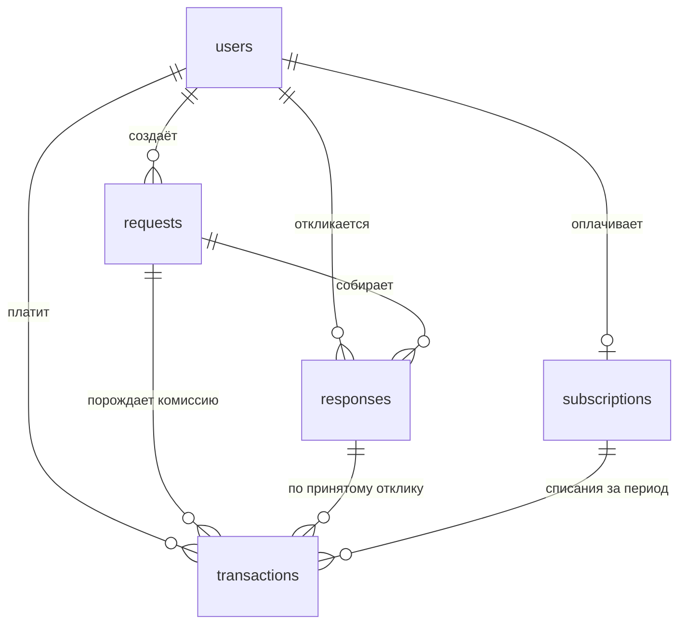

# OPUS GROUP

От фото дома до бригады на объекте — конструктор, который строит 3D-модель
дома по фотографиям, считает смету на материалы по ходу редактирования и
подбирает бригаду для монтажа.

See `DESIGN.md` for the design system (color tokens, type scale, layout
wireframe, and the signature landing element).

## Stack

- Next.js (App Router) + TypeScript + Tailwind CSS v4
- `@react-three/fiber` + `@react-three/drei` for the 3D editor canvas
- `zustand` for editor/cart state
- `motion` for the landing hero's photo-to-model reveal
- Self-hosted Unbounded + Manrope (`public/fonts`, `src/app/fonts.css`) — no
  Google Fonts CDN

## 3D provider

The 3D generation vendor (Neural4D) isn't wired up yet. Every screen is
built against the `Model3DProvider` interface in `src/lib/3d/provider.ts`
and runs against `MockModel3DProvider` (`src/lib/3d/mock-provider.ts`),
which returns a believable demo house after a realistic delay. Swapping in
the real vendor later means adding one class and changing the factory in
`src/lib/3d/index.ts` — nothing else in the app touches the vendor
directly. Vendor requests must proxy through a backend route; never call
Neural4D from the browser.

## Getting started

```bash
npm install
npm run dev
```

Open [http://localhost:3000](http://localhost:3000). The editor
(`/editor`) works fully offline against the mock provider — use "Посмотреть
на демо-доме" to skip straight to a generated model.

## Scripts

```bash
npm run dev     # start the dev server
npm run build   # production build
npm run lint    # eslint
npm run db:check # проверить подключение к PostgreSQL
npm run db:migrate        # применить новые миграции
npm run db:migrate:status # посмотреть, что применено, а что нет
```

## Где вписать ключ Neural4D

**Локально:** в файле `.env` в корне проекта, строка `NEURAL4D_API_KEY=` —
впишите значение сразу после `=`, без кавычек и пробелов. Файл в git не
попадает. После правки перезапустите dev-сервер: `.env` читается при старте.

**На Vercel:** Settings → Environment Variables → `NEURAL4D_API_KEY`.
Никакого префикса `NEXT_PUBLIC_` — с ним Next подставит значение в
браузерный бандл, и ключ увидит любой посетитель.

Пока ключ пуст, `/api/neural4d/generate` отвечает `{ configured: false }`, и
приложение работает на демо-модели — то есть пустой `.env` ничего не ломает.

### Как устроена защита

- `NEURAL4D_API_KEY` читает единственный модуль — `src/lib/server/neural4d-config.ts`.
  Он импортирует `server-only`, поэтому сборка **падает**, если его случайно
  импортировать из клиентского компонента.
- Браузер никогда не обращается к вендору. Фотографии уходят на наш маршрут
  `POST /api/neural4d/generate`, и ключ добавляется там, на сервере.
- Ключ не логируется. В лог пишется только статус ответа вендора; наружу
  уходит обобщённое сообщение, а не тело чужого ответа.
- Адрес вендора задаётся только через окружение и никогда клиентом — иначе
  маршрут стал бы открытым прокси (SSRF).

Проверено «канарейкой»: со подставленным тестовым значением сборка не
содержит его ни в одном файле `.next/static`, а ответы и логи чисты.

## База данных PostgreSQL

Проект подключается к Managed Service for PostgreSQL в Yandex Cloud. Все
настройки — только через переменные окружения, ни одного значения в коде.

**Как настроить локально:**

1. `cp .env.example .env`
2. Заполните в `.env` четыре обязательные строки: `DB_HOST` (FQDN хоста из
   консоли Yandex Cloud, вида `rc1b-xxxxxxxxxxxxxxxx.mdb.yandexcloud.net`),
   `DB_NAME`, `DB_USER`, `DB_PASSWORD`. `DB_PORT` уже стоит `6432` — это порт
   пулера соединений, подключаться нужно через него.

   Хост можно вставлять прямо из адресной строки: `https://` и слэш на конце
   срезаются сами. А вот публичный доступ к хосту должен быть включён
   (Кластер → Хосты → Изменить), иначе имя не существует в публичном DNS и
   подключиться снаружи облака нельзя в принципе.
3. Скачайте корневой сертификат облака и укажите путь к нему в
   `DB_SSL_ROOT_CERT`:

   ```bash
   mkdir -p ~/.postgresql
   curl -o ~/.postgresql/root.crt https://storage.yandexcloud.net/cloud-certs/CA.pem
   ```

4. `npm run db:check` — скрипт делает один тестовый запрос и печатает, к чему
   подключился, или объясняет, что именно не так.

**На Vercel:** те же имена в Settings → Environment Variables. Префикса
`NEXT_PUBLIC_` быть не должно — с ним Next подставит пароль в браузерный
бандл. Файла на диске там нет, поэтому `DB_SSL_ROOT_CERT` не задаётся:
соединение остаётся шифрованным, но без проверки сертификата.

### Как это устроено

- `src/lib/server/db-config.ts` — единственное место, которое читает пароль.
  Импортирует `server-only`, поэтому сборка **падает** при случайном импорте
  из клиентского компонента.
- `src/lib/server/db.ts` — пул соединений (`getPool`, `query`, `pingDatabase`).
  Пул создаётся лениво и переиспользуется между горячими перезагрузками, иначе
  за час разработки был бы выбран лимит соединений базы.
- Запросы всегда параметризованные (`$1`, `$2`), склейки строк с SQL нет —
  значение не может превратиться в код (SQL-инъекция).
- `.env` закрыт `.gitignore` (`.env*`, кроме `.env.example`), поэтому реальный
  пароль в GitHub не попадёт.

## Схема базы и миграции

Схема живёт в `migrations/` — обычные `.sql`-файлы с номерами. Применённые
записываются в таблицу `schema_migrations` в той же базе, поэтому список
применённого не может разойтись с данными при копировании базы.

```bash
npm run db:migrate:status   # что применено, а что ещё нет
npm run db:migrate          # применить всё, что осталось
```

**Правило одно: применённый файл не редактируют.** База помнит его
контрольную сумму и откажется работать, если файл изменился, — иначе правка
молча не доехала бы до сервера, где эта версия уже отмечена выполненной.
Любое изменение схемы — новый файл со следующим номером.

Каждый файл применяется в транзакции: либо целиком, либо база остаётся
нетронутой. Схема, застрявшая на середине файла, чинится руками на живом
сервере — этого допускать нельзя.

### Таблицы



| Таблица | Что хранит | Ключевые правила |
|---|---|---|
| `users` | все люди: `client`, `executor`, `moderator`, `admin` | нужен хотя бы один контакт — почта или телефон; почта уникальна без учёта регистра |
| `requests` | заявки клиентов: что, где, по какой модели дома | модель из редактора лежит целиком в `scene_model jsonb`; опубликованная заявка обязана иметь `published_at` |
| `responses` | отклики исполнителей: цена, срок, сообщение | один отклик от исполнителя на заявку; принятый отклик только один; на свою заявку откликнуться нельзя |
| `subscriptions` | подписка исполнителя (в интерфейсе — «Technic») | одна действующая подписка на человека; доступ проверяется по `current_period_end`, а не по `status` |
| `transactions` | оплата подписок, комиссия со сделок, выплаты, возвраты | `net_amount = gross_amount − commission_amount` проверяется базой; `commission_rate` — доля (`0.0700` = 7%) |

Деньги — `numeric(14, 2)`, никогда `float`: `double precision` хранит `0.1`
приблизительно, и на сотне комиссий сумма разъезжается с бухгалтерией.
Ставка комиссии хранится вместе с суммой, а не берётся из настроек при
чтении: ставка со временем меняется, и пересчёт старых сделок по новой
ставке испортил бы прошлые отчёты.

Удаление людей — `ON DELETE RESTRICT`: заявка без автора и платёж без
плательщика ломают отчётность. Ушедший пользователь получает
`status = 'deleted'`, строки остаются.

## Deploying to Vercel (free Hobby tier)

Pages prerender as static; the one server function is the Neural4D proxy at
`/api/neural4d/generate`. No environment variables are required to deploy —
without a key the app runs on the demo model. `npm ci && npm run build` is verified green against
the committed lockfile, which is exactly what Vercel runs.

**Through the dashboard (easiest):**

1. Sign in at [vercel.com/new](https://vercel.com/new) with the GitHub
   account that owns this repository.
2. Import `andrewanashkin9-dot/OPUS-GROUP`. Vercel detects Next.js and
   fills in the framework preset, build command and output directory —
   leave all of it alone.
3. Press **Deploy**. First build takes roughly two minutes; you get a
   `*.vercel.app` URL.

The repository's default branch is `claude/opus-group-frontend-imhos3`, so
Vercel uses it as the Production Branch automatically. Every later push to
it redeploys production; other branches get preview URLs.

**Through the CLI:**

```bash
npm i -g vercel
vercel login
vercel --prod
```

For the API key, see **Где вписать ключ Neural4D** above.
